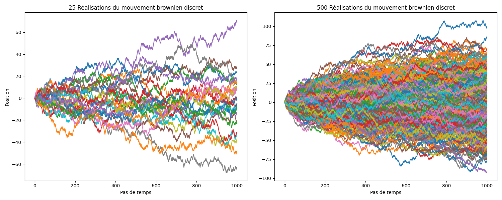

# Définition

On considère un espace probabilisé $(\Omega, \mathcal{F}, \mathbb{P})$, un espace mesurable $(E, \mathcal{E})$ et un ensemble $T$.

**Définition** On appelle **processus stochastique**, ou processus aléatoire, une famille $(X_t)_{t \in \mathcal{T}}$ de variables aléatoires à valeurs dans $E$. 

Autrement dit, pour tout $t \in \mathcal{T}$, l'application $\omega \mapsto X_t(\omega)$ est une application mesurable de $(\Omega, \mathcal{F})$ dans $(E, \mathcal{E})$. On appelle $E$ l'espace d'état du processus.

:::{note} Remarque
$X_t$ est souvent l'expression d'une variable à un temps t, où$\mathcal{T}$ représente l'ensemble des dates possibles.
:::

**Définition** 
- Lorsque $\mathcal{T} = \mathbb{N}$ ou  $\mathcal{T} = \mathbb{Z}$, on parle de **processus à temps discret**
- Lorsque $\mathcal{T} = \mathbb{R}$, on parle de **processus à temps continu**

:::{note} Exemple de processus à temps discret
 Evolution du PIB de la France par année où $X_t$ représente le PIB, $t \in \mathbb{N}$ est l'année.
:::

:::{note} Exemple de processus à temps continu
Processus à temps continue : évolution du cours d'une action où $X_t$ est la valeur de l'action, $t \in \mathbb{R_+}$ est le temps, considéré comme continu étant donnée la fréquence de rafraîchissement des valeurs.
:::

**Définition** On appelle **filtration** une suite $(\mathcal{F_t})_{t \in \mathcal{T}}$ $\sigma$-algèbres vérifiant 
$$ s \leq t \Rightarrow \mathcal{F_s} \subset \mathcal{F_t} \subset \mathcal{F}  $$

:::{note} Remarque
On utilise la notion de filtration pour représenter l'information disponible à date $t$.

Quand on observe un processus au cours du temps, on connaît les valeurs de $X_s$ pour $s \leq t$, mais pas encore pour $s \gt t$. On sera donc souvent amenés à conditionner par les variables $(X_s)_{s \leq t}$.
:::

**Définition** Le processus $(X_t)_{t \in \mathcal{T}}$ est dit adapté à la filtration $(\mathcal{F_t})_{t \in \mathcal{T}}$, si pour tout $t \in \mathcal{T}$, $X_t$ est $\mathcal{F}_t$-mesurable.

## Exemples :

- **Processus Auto-Régressifs (AR)** Dans cet exemple, $\mathcal{T} = \mathbb{N}$. Soit $(\epsilon_t)_{t \in \mathbb{N}}$ une suite de variables aléatoires i.i.d de loi $\mathcal{N}(0, 1)$, $(\alpha, \beta) \in \mathbb{R}^2$, $X_0 = 0$ et
$$ X_{t+1} = \alpha X_t + \beta + \epsilon_t$$

On définit $\mathcal{F}_t = \sigma({\epsilon_s, s \leq t})$. On peut vérifier que le processus $(X_t)_{t \in \mathbb{N}}$ est adapté à la filtration $(\mathcal{F_t})_{t \in \mathbb{N}}$. 

- Les **processus de Markov**, dont les transitions ne dépendent que de l'état précédent, 
  $$ \mathcal{P}(X_{t+1}| \mathcal{F}_t) = \mathcal{P}(X_{t+1}| X_t) $$

- Les **processus gaussiens** $(X_t)_{t \in \mathcal{T}}$, pour lesquels toutes les lois fini-dimensionnelles $\mathcal{L}(X_{t_1}, .. , X_{t_n})$ sont gaussiennes. On définit les processus gaussiens par une moyenne au cours du temps $m(t) = \mathbb{E}[X_t]$ et un opérateur de covariance $K(s, t) = Cov(X_s, X_t)$

- Le **filtre Kalman**, un exemple particulier de processus gaussiens, pour lequel l'état d'un système dynamique est estimé, conditionné à des observations :
$$\hat{X}_k = \mathbb{E}[X_k]$$
$$\mathrm{P}_k = \mathbb{E}[(X_k - \hat{X}_k)(X_k - \hat{X}_k)^T] $$
$$ p(X_k | Z_k) \sim \mathcal{N}(\hat{X}_k, \mathrm{P}_k) $$

# Marche aléatoire

**Comment décrire les transitions entre états, y compris en temps continu ?**

## Vers une description formelle des transitions entre états

On prend un monde divisé en cases (numérotées chacune par un indice n). A chaque pas de temps,
la particule fait un saut sur une case immédiatement à sa droite ou à sa gauche.

- Quelle est la probabilité $P(n,t)$ de trouver la particule dans la case $n$, au temps $t$ ? 

_(sachant que la particule début à la case $n=0$ à $t=0$)_ 

On cherche à décrire $P(n, t_i)$, pour un temps $t_i$ donné, ou autrement dit, on cherche à faire une coupe temporelle du mouvement brownien au temps $t_i$.

Pour cela, nous nous intéressons à extraire les moments statistiques, ici, la moyenne et la variance du processus en fonction du temps.

Ici, on remarque que (figure de droite), **la moyenne est nulle** à chaque pas de temps, et **la variance évolue linéairement** en fonction du temps.

**Démonstration** 

Soit $D$ la variable aléatoire de déplacement à chaque tour. $D$ prend les valeurs $\pm 1$ avec une probabilité de $0,5$.

Sa moyenne est $\mu = \langle D \rangle = 0$ et sa variance $\sigma^2 = \langle (D - \mu)^2 \rangle$.

La position de la particule est une variable aléatoire $X$ qui s'exprime au bout de $T$ pas de temps comme la somme de $T$ déplacements $D$ indépendants.

On obtient :
$$\langle X(T) \rangle = \langle \sum^{T}_{t=0} D_t \rangle = 
 \sum^{T}_{t=0} \langle D_t \rangle = 0$$
$$ Var(X(T)) = Var(\sum^{T}_{t=0} D_t) =  \sum^{T}_{t=0} Var(D_t) = T \sigma^2$$

:::{note} Marche aléatoire et mouvement brownien

Une fois la marche aléatoire introduite, nous cherchons à étendre sa définition et sa validité pour
des espaces et des temps continus. 

- L'extension à des espaces continus se fait relativement aisément en introduisant une loi
de probabilité continue pour les transitions.

- L'extension au temps continu nécessite l'introduction du **Mouvement Brownien**. Le challenge étant de générer une trajectoire à la fois continue et aléatoire. 
:::

## Généralisation vers le temps continu

**Généralisation à d'autres lois** Le résultat précédent se généralise aisément à d'autres lois de probabilité de transition, mais le résultat est le même : la variance croit linéairement avec le temps.

- Quelle modélisation quand le pas de temps $\delta t$ tend vers 0 ?

**Généralisation au temps continu** On décrit les probabilités de saut comme une densité qui dépend du pas de temps : $W(n) \delta t$.

On note :
- $W^-(n)$ : **densité de probabilité** ou **taux de transition** de saut vers la gauche
 à partir de la case $n$.
- $W^+(n)$ : **densité de probabilité** ou **taux de transition** de saut vers la droite. 

Cette description peut être étendue à des sauts de plusieurs cases, en considérant $W(n,m)$ : densité de probabilité de sauter de $n$ à $m$. Et, éventuellement, à un espace d'états continus _(non traité formellement dans le cours)_. 

**Vers l'équation Maîtresse**

En reprenant les sauts de $\pm 1$ case, nous pouvons effectuer un bilan infinitésimal (analogue aux bilans de physique).

- Probabilité d'aboutir à la case $n$ à $t + \delta t$ ?

3 possibilités :
1. La particule est en $n + 1$ à t et saute vers $n$, avec une probabilité de $W^-(n+1) dt$
2. La particule est en $n - 1$ à t et saute vers $n$, avec une probabilité de $W^+(n-1) dt$
3. La particule reste en $n$ avec une probabilité de $1 - (W^+(n) + W^-(n))$

En reprenant les sauts de $\pm 1$ case, nous pouvons effectuer un bilan infinitésimal (analogue aux bilans de physique).

- Probabilité d'aboutir à la case $n$ à $t + \delta t$ ?

On obtient alors (avec des évènements indépendants):

$$P(n, t+dt) = 
\begin{array}{rcl} 
P(n+1, t)W^-(n+1)dt \\
+ P(n-1, t) W^+(n-1)dt \\
+ P(n,t)(1 - (W^+(n) + W^-(n)))dt 
\end{array}
$$

En reprenant les sauts de $\pm 1$ case, nous pouvons effectuer un bilan infinitésimal (analogue aux bilans de physique).

- Probabilité d'aboutir à la case $n$ à $t + \delta t$ ?

Ce qui nous mène à établir **l'équation Maîtresse** :

$$\frac{\partial P(n,t)}{\partial t} = \begin{array}{rcl}
&W^+(n-1)P(n-1,t)& - &W^-(n)P(n,t) \\
 +& W^-(n+1,t)P(n+1,t)& -& W^+(n)P(n,t) \\
\end{array}
 $$

Nous obtenons en quelque sorte un **bilan de flux de probabilités** entre cellules adjacentes, telle qu'elle pourrait être établie en physique statistique, avec un flux sur la 
face gauche de la cellule, et un flux sur la face droite.

On peut ainsi généraliser l'équation précédente à des transitions entre états $m,n$ quelconques.

$$\frac{\partial P(n,t)}{\partial t} = \sum_{m} W(m \rightarrow n)P(m,t) - W(n \rightarrow m)P(n,t)$$

Formellement, on écrira :

$$\partial_t P(t) = \mathcal{L} P(t)$$

avec $\mathcal{L} = \mathcal{L}^n_m = W(m \rightarrow n)$ la matrice de transition entre états $n,m$ et $P(t)$ le vecteur colonne des cellules du système.

:::{note} On arrive ici au bout du travail de formalisation. L'exemple bilan sur un mouvement brownien avec des sauts élémentaires $\pm 1$ pouvant être généralisé à d'autres problèmes avec des transitions plus complexes.
:::

## Moyenne et Variance d'un processus stochastique en temps continu

Après insertion des moments d'ordre 1, $\langle n(t) \rangle = \sum_n n P(n,t)$ ,et d'ordre 2,  $\langle n^2(t) \rangle = \sum_n n^2 P(n,t)$, dans l'équation maîtresse, nous obtenons,

**Moyenne** :

$$\frac{d  \langle n(t) \rangle}{dt} = \langle W^+(n) - W^-(n) \rangle = \sum_n (W^+(n) - W^-(n))P(n,t) $$

**Variance** :

$$\frac{d V}{dt} = 2 \langle (n - <{n}>) (W^+(n) - W^-(n))\rangle + \langle W^+(n) + W^-(n)\rangle$$

:::{note} Exploitation des résultats
Ces formules (un peu ingrates), nous permettent d'extraire une équation différentielle pour chacun des moments de la distribution, et obtenir ainsi la moyenne et la variance du processus au cours du temps.
:::

# Le Mouvement Brownien

On a vu que pour une marche aléatoire, avec des sauts de $\pm 1$ équiprobables, la coupe temporelle à un pas de temps 
donné $t \in \mathbb{N}$, la distribution des positions se rapproche d'une gaussienne. 

On peut alors formaliser le mouvement brownien, en temps continu, par rapport à cette observation.

**Définition** Soit $B = (B_t)_{t \geq 0}$ une famille de variables aléatoires indexées dans le temps. On dit que $B$ est un
mouvement brownien si c'est un processus à trajectoires continues telles que 
1. $\forall t \geq 0 : B_t \sim \mathcal{N}(0, t)$
2. Pour tout $0 \geq t_1 \geq ... \geq t_n$, les variables aléatoires $B_{t_1}, B_{t_2} - B_{t_1}, ..., B_{t_n} - B_{t_{n-1}}$, sont indépendantes.

:::{note} Remarque
La seconde propriété signifie que le mouvement brownien n'a pas de mémoire du passé.
:::

:::{note} Historique
Le mouvement brownien est décrit empiriquement à la fin du $XIX^e$ siècle, avant d'être formalisé par
Wiener en 1923 (d'où le nom de **Processus de Wiener** et les notations $W(n,m)$ vues précédement).

Le Mouvement Brownien en dates :
- 1827 : le botaniste Brown observe les mouvements désordonnés d'une particule en suspension dans un liquide,
- 1900 : Bachelier étudie les fluctuations du cours de la bourse,
- 1905 : Einstein étudie les impulsions transmises à une particule par les molécules environnantes,
- 1923 : Wiener établi un modèle de processus dont les trajectoires sont continues et les vitesses infinies en tout point.
:::

# Le Processus Gaussien

Un processus stochastique est gaussien si toutes ses lois fini dimensionnelles sont gaussiennes.
Il est défini par :

1. $m : I -> \mathbb{R} m(t) = \mathbb{E}[X_t] $,
2. $\Gamma : I x I -> mathbb{R}, \Gamma(s,t) = Cov(X_s, X_t)$

# Un exemple de processus stochastique, le processus de Poisson

Le processus de Poisson est fondamental pour comprendre les processus stochastiques. On le rencontre sur plusieurs phénomènes :
- Nombre de particules radioactives qui se désintègrent pendant un temps $t$,
- Nombre de communications reçues par un central sur une période $\Delta T$,
- Réaction chimique.

**Exemple d'une particule radioactive** :

On note $\alpha dt$ la probabilité de désintégration
 d'une particule sur un temps $dt$

 - Quelle est la probabilité d'observer $n$ évènements pendant un temps $t$ ? 

 - On note : $W^+(n) = \alpha$, et $W^-(n) = 0$, (la probabilité de "ré-intégration", ou de l'évènement contraire est nulle).

 Selon l'équation Maîtresse :

 $$\frac{\partial P(n,t)}{\partial t} = \alpha (P(n-1,t) - P(n,t)), n \geq 1$$
 $$\frac{\partial P(n,t)}{\partial t} = \alpha P(0,t) $$

 Sa résolution donne :

$$ P(n,t) = e^{-\alpha t} \frac{(\alpha t)^n}{n!}$$

Exemple d'une particule radioactive :

 - Quelle est la probabilité d'observer $n$ évènements pendant un temps $t$ ? 
 - Quelles sont la moyenne et la variance du processus ?

 Selon l'équation Maîtresse :

 $\frac{\partial \langle n(t) \rangle}{\partial t} = \sum_n  (W^+(n) - W^-(n)) P(n;t) = \alpha$, avec $n(t=0)=0$ 
 
 donc 
 $\langle n(t) \rangle = \alpha t$

 et
 $\frac{\partial \langle n^2(t) \rangle}{\partial t} = 2 \langle \alpha n \rangle + \langle \alpha \rangle = 2 \alpha \langle n \rangle + \alpha$ avec variance nulle à l'origine $\langle n^2(0) \rangle = 0$ 
 
 donc $\langle n^2(t) \rangle = \alpha^2 t + \alpha t$.

 On obtient la moyenne et la variance d'un processus de Poisson :
 $$M = \langle n \rangle = \alpha t, V = \langle n^2 \rangle - \langle n \rangle^2 = \alpha t$$

# Exercice - Cinétique chimique

Nous posons $W^+(n) = \alpha, W^-(n) = \mu n$. L'équation de cinétique chimique est donnée par

$$\frac{d \langle n \rangle}{dt} = \alpha - \mu <n>$$
Avec $n_0 = 0$, on a $\langle n(t) \rangle = (\alpha / \mu)(1 - e^{-\mu t})$

1. Montrer que la variance vaut $V(t) = (\alpha/\mu)(1 - e^{-\mu t})$
2. Vérifier que pour l'état stationnaire, quand $\partial_t P = 0$, la solution est une distribution de Poisson de paramètre $\lambda = \alpha / \mu$

**Relations utiles** 
$$\frac{d \langle n \rangle}{dt} = <W^+(n) - W^-(n)>$$ 
$$\frac{d \langle n^2(t) \rangle}{dt} = 2 \langle n(W^+(n) - W^-(n)) \rangle + \langle W^+(n) + W^-(n) \rangle$$
$$\langle n \rangle = \sum_n n P(n,t), \langle n^2(t) \rangle = \sum_n n^2 P(n,t), \langle f(n) \rangle = \sum_n f(n) P(n,t)$$

# Synthèse

- Contruction d'un processus stochastique à partir des **taux de transition**, ou **densités de probabilités** de transition, 
- Analogie avec des bilans physiques,
- Après formulation d'un processus stochastique, les grandeurs qui nous intéressent sont la moyenne du processus (qui souvent correspond à la dynamique classique), et sa variance (ce qui nous permettra de quantifier des incertitudes).

:::{note} Synthèse
Ce chapitre pose les bases sur processus stochastiques. Nous avons introduit des processus avec des transitions aléatoires, y compris pour des temps continus. Cela qui permettra d'aller vers les modèles et applications lors des prochains cours : Filtre de Kalman, Processus Gaussiens, Chaînes de Markov.
:::

## En bref, les notions clés

- **Processus stochastique** : famille de variables aléatoires $(X_t)_{t \in \mathcal{T}}$ indexées sur le temps;

- **Temps discret** : $t \in \mathbb{N}$, le processus se modélise avec des **probabilités de transition**;

- **Temps continu** : $t \in \mathbb{R}$, le processus se modélise avec des **densités de probabilités** ou **taux de transitions** notés
$W(n,m)$  pour la transition entre de l'état $n$ vers l'état $m$;

- **Equation Maîtresse** : équation différentielle qui représente l'évolution temporelle de la densité de probabilité. Elle s'établit de manière analogue à un bilan physique (entre $t$ et $t + \delta t$). 
Cette équation nous permet d'introduire et étudier une **dynamique** de la dispersion.

- **Relations sur la moyenne et la variance** : à partir de l'équation maîtresse, on peut déduire l'évolution temporelle de la moyenne et de la variance du processus.

$$\frac{d \langle n \rangle}{dt} = \langle W^+(n) - W^-(n) \rangle$$
$$\frac{dV}{dt} = 2 \langle(n - \langle n \rangle)(W^+(n) - W^-(n)) \rangle+ \langle W^+(n) + W^-(n) \rangle$$

- **Marche aléatoire**

- **Mouvement brownien**

# Références 

[Houchmandzadeh, B.: Processus stochastiques, ](https://hal.science/cel-01148909v3/file/Stochastic2.pdf)

[Chopin, N.: Introduction aux processus stochastiques, Notes de cours](https://nchopin.github.io/files/poly_processus.pdf)

