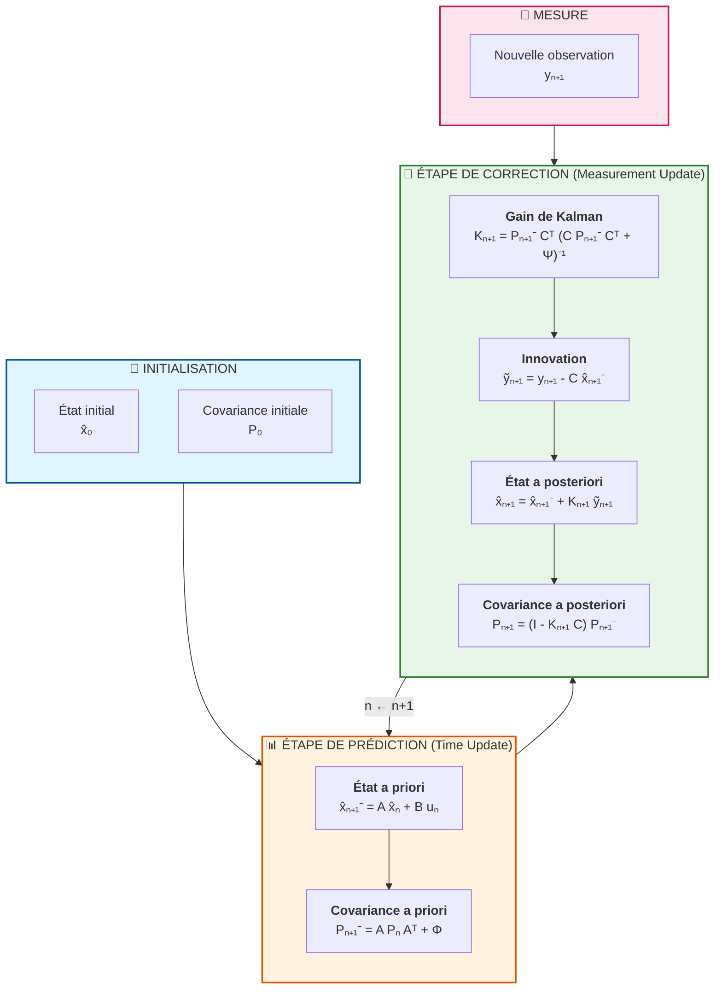
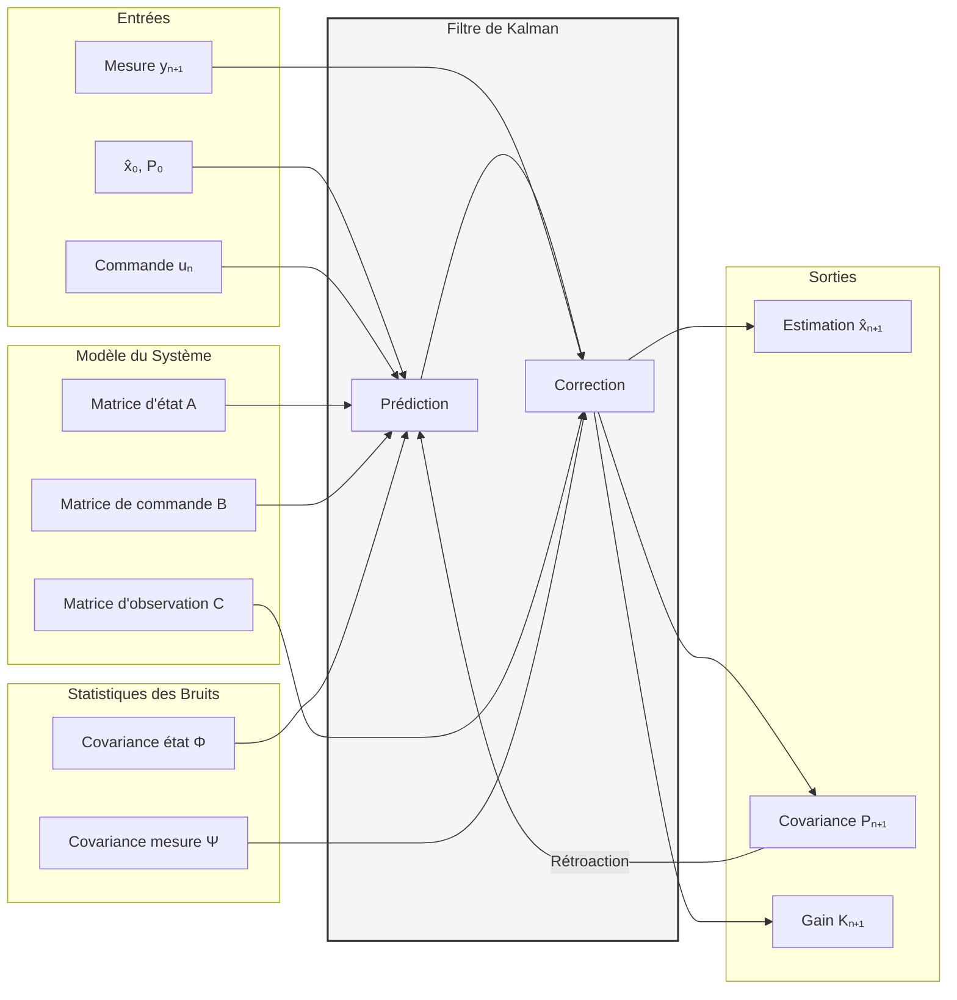
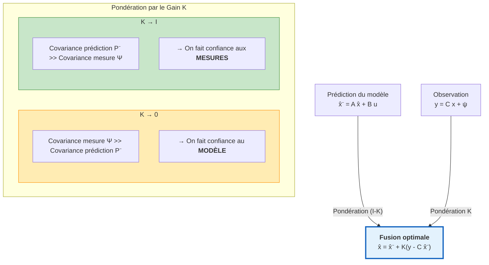
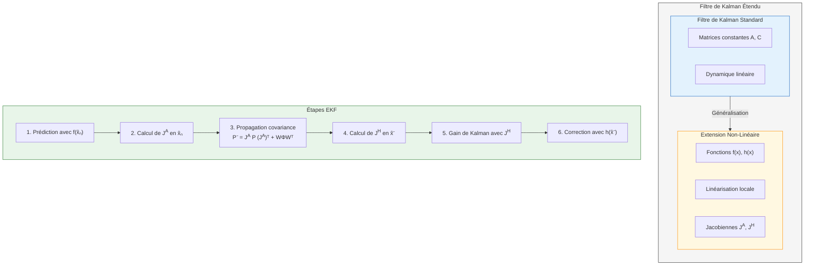

**Filtre de Kalman** (1960), Rudolf Kalman (mathématicien hongrois) : utilisé pour la première fois pour l'estimation de trajectoire des programmes Apollo.

$\rightarrow$ Comment concilier au mieux l'information disponible (capteurs), et les équations de la dynamique pour contrôler un système ?

# Contrôle d'un système dynamique

**Système dynamique discret**

$$x_{n+1} = A x_n + B u_n + \phi_n$$
$$y_{n+1} = C x_{n+1} + \psi_{n+1}$$

où, à chaque instant $n$:
- $x_n$ est l'état du système. _Exemple : Température d'un moteur d'avion_. 
- $u_n$ est la commande du système. _Exemple : Débit de carburant dans le moteur_.
- $y_n$ est la mesure de l'état du système. _Exemple : Mesure renvoyée par le thermomètre_.

:::{note} Notations en météorologie
En météo, on appellerait $C$ un **opérateur d'observation**. C'est le lien entre **l'espace des mesures** (ex : la tension au bornes thermomètre), et **l'espace d'état** (ex : la température effective de l'air). 
:::

## Bruits associés au système

**Système dynamique discret**

$$x_{n+1} = A x_n + B u_n + \phi_n$$
$$y_{n+1} = C x_{n+1} + \psi_{n+1}$$

**Représentation des bruits** :
1. **Bruit d'état** $\phi_n$: représente notre méconnaissance de la physique du système. 
    - _Exemple : Variations de la richesse du mélange_.
2. **Bruit de mesure** $\psi_n$: représente un bruit de mesure. 
    - _Exemple: bruit électronique de la sonde de température_.

**Hypothèse** : Les bruits $\phi$ et $\psi$ sont supposés blancs, gaussiens, centrés, stationnaires
et indépendants l'un de l'autre. Ces bruit sont chacun associé à une matrice de covariance $\Phi$, et $\Psi$. 

# Construction d'un estimateur

On cherche à construire un estimateur qui dépende de l'état estimé à l'instant précédent, de la mesure renoyée 
par le capteur et de la comande imposée.

Nous construisons alors un estimateur de la forme :

$$ \hat{x}_{n+1} = A_f \hat{x}_n + B_f u_n + K_{n+1} y_{n+1}$$

$\rightarrow$ Comment construire $A_f$, $B_f$, $K_{n+1}$ ?

:::{note} Construction de l'estimateur
On cherche à construire un estimateur de la forme générique $\hat{x}_{n+1} = f(\hat{x}_n, y_{n+1}, u_n)$.

Nous nous concentrons sur des systèmes linéaires, et verrons plus tard comment l'étendre à des systèmes non-linéaires.
:::

## Estimateur (assymptotiquement) sans biais

**Erreur d'estimation** :  On cherche à minimiser l'erreur d'estimation, définie ci-dessous,

$$e = \hat{x} - x$$

Pour un estimateur parfait, on aurait $\forall n \in \mathbb{N}, e_n = 0$. 

Sans accès aux vraies valeurs de 
$x$ et face à un processus stochastique, annuler l'erreur est généralement impossible.
Nous décrivons alors (non sans mal) l'erreur $e_{n}$ par récurrence:

$$e_{n+1} = \begin{array}{rcl}
(I - K_{n+1} C) A e_n
+ (A_f + K_{n+1} CA -A) \hat{x}_n + (B_f +K_{n+1}CB - B) u_{n} \\
+ (K_{n+1} C - I) \phi_n + K_{n+1} \psi_{n+1}
\end{array}$$

**Espérance de l'erreur** Sachant que les bruits blancs gaussiens sont d'espérance nulle : 

$\forall n \in \mathbb{N}, \, \mathbb{E}[\phi_n] = 0, \mathbb{E}[\psi_n] = 0$, on décrit l'évolution, l'espérance de l'erreur.

$$\mathbb{E}[e_{n+1}] = (I - K_{n+1}C) A\, \mathbb{E}[e_n] + (A_f + K_{n+1}CA - A)\, \hat{x}_n + (B_f + K_{n+1} CB - B) u_n$$

**Estimateur assymptotiquement sans biais** 

On cherche à construire un estimateur dont l'espérance de l'erreur tend vers 0.  

**Définition** 
$$\lim_{n \rightarrow \infty} \mathbb{E}[e_n] = 0$$

**Espérance de l'erreur** Sachant que les bruits blancs gaussiens sont d'espérance nulle : 

$\forall n \in \mathbb{N}, \, \mathbb{E}[\phi_n] = 0, \mathbb{E}[\psi_n]$, on décrit l'évolution, l'espérance de l'erreur.

$$\mathbb{E}[e_{n+1}] = (I - K_{n+1}C) A\, \mathbb{E}[e_n] + (A_f + K_{n+1}CA - A)\, \hat{x}_n + (B_f + K_{n+1} CB - B) u_n$$

**Estimateur assymptotiquement sans biais**  $\rightarrow\, \lim\limits_{n \rightarrow \infty} \mathbb{E}[e_n] = 0$

**Conditions suffisantes**
1. $B_f + K_{n+1}\, CB - B = 0$ (_on annule le terme lié à la comande $u_n$_)
2. $A_f + K_{n+1}\, CA - A = 0$ (_on annule le terme dû à l'estimation $\hat{x}_n$_)
3. $(I - K_{n+1}C)$ est stable (_module inférieur à 1 pour que l'erreur puisse décroître )_ 

## Construction des Matrices du filtre
Filtre de Kalman

Les conditions de stabilité fixent les matrices $A_f$ et $B_f$.

$$A_f = (I - K_{n+1}C)A$$
$$B_f = (I - K_{n+1}C)B$$

Il reste à régler $K_{n+1}$ pour que $(I - K_{n+1}C)$ soit stable.

**Définition** : $K$ est appelé le **gain du filtre**.

**Forme de l'estimateur** : Nous établissons (et rencontrons souvent) la forme suivante du filtre.

$$\hat{x}_{n+1} = A \hat{x}_n + B u_n + K_{n+1} [y_{n+1} - C(A \hat{x}_n + B u_n)]$$

:::{note} Gain du filtre : un compromis 
**Remarque** $K$ peut être vu comme un compromis à régler entre la fidélité au modèle numérique ($A \hat{x}_n + B u_n$) et la
fidélité aux valeurs de mesure ($y_{n+1}$). 
:::

## Filtre Prédicteur - Correcteur

Le filtre de Kalman est un filtre **prédicteur-correcteur**, l'estimation $\hat{x}$ de $x$ se contruit en 2 temps :

**Mise à jour de l'état** :

1. **Prédiction** : Estimation à priori de l'état $\hat{x}^-$, 
comme si on n'avait que les équations du système
à disposition.

2. **Correction** : Construction de l'estimation à posteriori avec l'information apportée par les mesures.

**Mise à jour des matrices de covariance** (liées au bruit ajouté à chaque pas) :

1. **Prédiction** : Estimation de la matrice de covariance $P_k^-$,
par rapport au **bruit d'état** $Q$ (ou $\Phi$ comme noté précédemment).   

2. **Correction** : Construction de la matrice de covariance $P_k$ par rapport au **bruit de mesure** $R$ (ou $\Psi$ comme noté précédemment).

### Schéma de la boucle Prédicteur-Correcteur

```mermaid
flowchart TB
    subgraph INIT["🔧 INITIALISATION"]
        direction TB
        I1["État initial<br/>x̂₀"]
        I2["Covariance initiale<br/>P₀"]
    end

    subgraph PREDICT["📊 ÉTAPE DE PRÉDICTION (Time Update)"]
        direction TB
        P1["<b>État a priori</b><br/>x̂ₙ₊₁⁻ = A x̂ₙ + B uₙ"]
        P2["<b>Covariance a priori</b><br/>Pₙ₊₁⁻ = A Pₙ Aᵀ + Φ"]
        P1 --> P2
    end

    subgraph CORRECT["📐 ÉTAPE DE CORRECTION (Measurement Update)"]
        direction TB
        C1["<b>Gain de Kalman</b><br/>Kₙ₊₁ = Pₙ₊₁⁻ Cᵀ (C Pₙ₊₁⁻ Cᵀ + Ψ)⁻¹"]
        C2["<b>Innovation</b><br/>ỹₙ₊₁ = yₙ₊₁ - C x̂ₙ₊₁⁻"]
        C3["<b>État a posteriori</b><br/>x̂ₙ₊₁ = x̂ₙ₊₁⁻ + Kₙ₊₁ ỹₙ₊₁"]
        C4["<b>Covariance a posteriori</b><br/>Pₙ₊₁ = (I - Kₙ₊₁ C) Pₙ₊₁⁻"]
        C1 --> C2 --> C3 --> C4
    end

    subgraph MEASURE["📡 MESURE"]
        M1["Nouvelle observation<br/>yₙ₊₁"]
    end

    INIT --> PREDICT
    PREDICT --> CORRECT
    MEASURE --> CORRECT
    CORRECT -->|"n ← n+1"| PREDICT

    style INIT fill:#e1f5fe,stroke:#01579b,stroke-width:2px
    style PREDICT fill:#fff3e0,stroke:#e65100,stroke-width:2px
    style CORRECT fill:#e8f5e9,stroke:#2e7d32,stroke-width:2px
    style MEASURE fill:#fce4ec,stroke:#c2185b,stroke-width:2px
```

### Flux de données détaillé

```mermaid
flowchart LR
    subgraph Entrées
        X0["x̂₀, P₀"]
        U["Commande uₙ"]
        Y["Mesure yₙ₊₁"]
    end

    subgraph Modèle["Modèle du Système"]
        A["Matrice d'état A"]
        B["Matrice de commande B"]
        C["Matrice d'observation C"]
    end

    subgraph Bruits["Statistiques des Bruits"]
        PHI["Covariance état Φ"]
        PSI["Covariance mesure Ψ"]
    end

    subgraph Filtre["Filtre de Kalman"]
        PRED["Prédiction"]
        CORR["Correction"]
    end

    subgraph Sorties
        XHAT["Estimation x̂ₙ₊₁"]
        P["Covariance Pₙ₊₁"]
        K["Gain Kₙ₊₁"]
    end

    X0 --> PRED
    U --> PRED
    A --> PRED
    B --> PRED
    PHI --> PRED
    
    PRED --> CORR
    Y --> CORR
    C --> CORR
    PSI --> CORR
    
    CORR --> XHAT
    CORR --> P
    CORR --> K
    
    P -->|"Rétroaction"| PRED

    style Filtre fill:#f5f5f5,stroke:#333,stroke-width:2px
```

### Interprétation du Gain de Kalman

```mermaid
flowchart TB
    subgraph Confiance["Pondération par le Gain K"]
        direction LR
        
        subgraph CasK0["K → 0"]
            K0_desc["Covariance mesure Ψ >> Covariance prédiction P⁻"]
            K0_result["→ On fait confiance au <b>MODÈLE</b>"]
        end
        
        subgraph CasK1["K → I"]
            K1_desc["Covariance prédiction P⁻ >> Covariance mesure Ψ"]
            K1_result["→ On fait confiance aux <b>MESURES</b>"]
        end
    end

    MODEL["Prédiction du modèle<br/>x̂⁻ = A x̂ + B u"] 
    MESURE["Observation<br/>y = C x + ψ"]
    
    MODEL --> |"Pondération (I-K)"| FUSION
    MESURE --> |"Pondération K"| FUSION
    
    FUSION["<b>Fusion optimale</b><br/>x̂ = x̂⁻ + K(y - C x̂⁻)"]

    style CasK0 fill:#ffecb3,stroke:#ff8f00
    style CasK1 fill:#c8e6c9,stroke:#388e3c
    style FUSION fill:#e3f2fd,stroke:#1565c0,stroke-width:3px
```

_Par cohérence avec les notations du cours : $H \rightarrow C, Q \rightarrow \Phi, R \rightarrow \Psi$_

# Filtre de Kalman - Implémentation
## La recette de cuisine !

1. Initialisation de $\hat{x}$ à $\hat{x}_0$ : on peut par exemple prendre la valeur $y_0$ renvoyée par le capteur.

2. Initialisation de $P$ à $P_0$ :  on peut prendre la valeur $\Psi$ de la covariance de bruit du capteur.

3. Evolution de $K$ selon :
$$K_{n+1} = (A P_n A^T + \Psi)C^T \times (C A P_n A^T C^T + C \Psi C^T + \Psi)^{-1}$$

4. Evolution de $\hat{x}$ selon :
$$\hat{x}_{n+1} = A \hat{x}_n + B u_n + K_{n+1} [y_{n+1} - C(A \hat{x}_n + B u_n)]$$

5. Evolution de $P$ selon :
$$P_{n+1} = (I - K_{n+1} C)(A P A^T + \Phi) $$

## Est-ce que ça marche vraiment en pratique ?
Considérations sur l'évolution de la variance 

On a établit que $\lim\limits_{n \rightarrow \infty} \mathbb{E}[e_n] = 0$,  ainsi que la formule pour $P_{n+1}$. 

$\rightarrow$ Est-ce qu'on est obligé d'attendre l'$\infty$ pour que le filtre commence à fonctionner ?

$\rightarrow$ En pratique, comment fixer $K_{n+1}$ le gain du filtre ?

**Dispersion** Nous allons travailler sur la dynamique de l'erreur $e_n$ et sa dispersion, pour 

$$P = \mathbb{E}[e_n \times e_n^T]$$

:::{note} Cas 1D
Dans un cas à une dimension, $P = \mathbb{E}[(\hat{x}_n - x_n)^2] = \mathbb{V}[e_n]$, s'écrit bien comme la variance de l'erreur.
:::

# Dynamique de l'erreur
## Choix du gain K

**Condition d'optimalité du gain du filtre** 

On cherche $K$ de telle sorte que la variance de l'erreur $P = \mathbb{E}[e \times e^T] \sim \mathbb{E}[e]$ soit minimale.

Un condition nécessaire est de chercher le gain $K$ tel que $P(k)$ soit extrêmal, autrement dit que 

$$\forall n \in \mathbb{N}, \frac{\partial P_{n+1}}{\partial K_{n+1}} = 0$$

**Dynamique de l'erreur** En maniuplant les équations du filtre, on obtient 

$$
e_{n+1} = (I - K_{n+1} C) A e_n + (K_{n+1} C - I) \phi_n + K_{n+1} \psi_{n+1}
$$
$$
\frac{\partial e_{n+1}}{\partial K_{n+1}} = - C A e_n + C \phi_n + \psi_n 
$$

On cherche le gain $K$ pour établir $\forall n \in \mathbb{N}, \frac{\partial P_{n+1}}{\partial K_{n+1}} = 0$

**Condition suffisante** 
$$\mathbb{E}[\frac{\partial e_{n+1}}{\partial K_{n+1}} e^T_{n+1}] = 0$$

**Formule de $K$ à partir de $P$**

$$P_{n+1} = (A P_nn A^T + \Psi) C^T \times (C A P_n A^T C^T + C \Phi C^T + \Psi)^{-1}$$

**Formule de $P$ à partir de $K$** (en prenant en compte $P_0 = \Psi$)

$$P_{n+1} = (I - K_{n+1} C)(A P_n A^T + \Phi)$$

:::{note} Remarque
On ne peut pas obtenir de condition d'optimalité, mais simplement d'une relation de récurrence entre $P$ et $K$. C'est elle qui nous permet d'implémenter $K$ en pratique.
:::

## BLUE - Best Linear Unbiased Estimator

**Estimateur sans biais** 

On cherche à obtenir un estimateur qui satisfait $\lim_{n \rightarrow \infty} \mathbb{E}[e_n] = 0$ (assymptotiquement sans biais).

**Gain optimal** 

On cherche à régler $K$ pour que les variances d'erreurs soit les plus faibles à chaque pas de temps, c'est-à-dire $\frac{\partial P_{n+1}}{\partial K_{n+1}} = 0$.

**Récurrence** 

Dans la mesure où nous ne connaissons pas les valeurs vraies $x_n$, nous tirons parti des relations de récurrence sur l'erreur $e_n$ pour progresser vers une erreur nulle.

C'est cela même qui fait la structure du Filtre Kalman. Et c'est bien pratique dans la mesure où le filtre ne dépend que des valeurs à l'état $n$ pour estimer l'état $n+1$ (le filtre est robuste et facile à mettre en oeuvre).

## Structure stochastique

**Point de départ**

- Bruit d'état $\phi \sim \mathcal{N}(0, \Phi)$ (ex : $\Phi$ donné par la distibution de températures au point de mesure, i.e. la climatologie du lieu),
- Bruit de mesure $\psi \sim \mathcal{N}(0, \Psi)$ (ex : $\Psi$, précision donnée par la fiche technique du capteur de température).

**Point d'arrivée**
- On modélise $P(x_n| z_n) \sim \mathcal{N}(\hat{x}_n, P_n)$, avec notre estimateur $\hat{x}_n$,
- Avec les propriétés de l'estimateur, on progresse vers $\mathbb{E}[\hat{x}_n] = x_k$ en gardant une dispersion minimale $\mathbb{E}[(x_n - \hat{x}_n)(x_n - \hat{x_n})^T] = P_n$.

## Implémentation pratique d'un filtre de Kalman

**Hypothèses structurantes** Il reste en pratique à vérifier que les bruits de mesure et d'état sont effectivement des bruits blancs gaussiens, stationnaires.

1. Qu'on a "suffisament capté" la dynamique du système et son observation dans les matrices $A$, $B$ et $C$, pour que les bruits $\Phi$ et $\Psi$ soient effectivement centrés.

2. Que les bruits puissent être assimilés à des bruits blancs gaussiens. Cela implique des tests statistiques, et éventuellement un travail sur les équations pour
centrer et réduire le bruit (lien avec le TCL).

3. Qu'il y ait effectivement indépendance entre le bruit de mesure et le bruit d'état. _Exemple : le capteur de température qui influence son environnement en 
ralentissant le flux d'air dont il mesure la température._

:::{note} En pratique
Il n'y a pas forcément de réponse systématique à ces questions, simplement un travail de mise au point du filtre, sur un problème donné $\rightarrow$ **Coeur du travail de l'ingénieur**
:::
 
# Exemple - Estimation d'une tension constante

**Problème** 

Nous cherchons à estimer une tension constante. Avec, à disposition, un volt-mètre, dont les mesures sont
perturbées par un bruit blanc d'écart-type $\sigma = 0.1 V$.

**Système linéaire**

$$x_{n+1} = x_{n} + \phi_{n+1}$$
$$z_{n+1} = x_{n+1} + \psi_{n+1}$$

**Equations du Filtre** Dans ce cas simple, $A_f = B_f = C = I = 1$, nous étudions alors l'estimation 
$\hat{x}$, la (co)-variance de l'erreur $P_n$ et le gain $K_n$, qui sont les charactéristiques essentielles du filtre. 

1. Prédicteur :

$$\hat{x}^-_{n+1} = \hat{x}_{n}$$
$$P^-_{n+1} = P_n + \Phi \; (= P_n + \mathbb{V}[\phi_{n+1}]) $$

2. Correcteur :

$$K_{n+1} = P^-_{n+1} (P^-_{n+1} + \Psi)^{-1} = \frac{P_n + \Phi}{P_{n} + \Phi + \mathbb{V}[\psi_n]}$$
$$\hat{x}_{n+1} = \hat{x}^-_{n+1} + K_{n+1}(z_{n+1} - \hat{x}^-_{n+1}) $$
$$P_{n+1} = (1 - K_{n+1}) P_{n+1}^-$$

**Hypothèses et modélisation**

1. Ici, on suppose une variance sur le bruit d'état : $\Phi = 1 \times 10^{-5}$. C'est à dire qu'on se laisse la
possibilité d'avoir un petit bruit d'état autour de la constante à mesurer (perturbations électromagnétiques ou autre).

2. Choix des conditions initiales : on suppose que la tension à mesurer est une constante tirée d'une loi normale centrée.

On fixe alors $x_0 = 0$, et on choisit une valeur arbitraire, mais non-nulle ($P_0 \neq 0$) pour $P_0$. Ici, $P_0 = 1$.

## Vraie valeur, Mesures, et Estimation (50 relevés)

_Source : Welch & Bishop, Intro to the Kalman Filter"_

## Vitesse de convergence - (Co)-Variance de l'erreur $P_n$

_Source : Welch & Bishop, Intro to the Kalman Filter"_

## Influence des bruits $\Psi$ et $\Phi$, avec $\Psi = 1$

_Source : Welch & Bishop, Intro to the Kalman Filter"_

## Influence des bruits $\Psi$ et $\Phi$, avec $\Psi = 1 .  10^{-5}$

_Source : Welch & Bishop, Intro to the Kalman Filter"_

# Dynamique Non-Linéaire - Filtre de Kalman Etendu

Remplaçons :
$$x_{n+1} = A x_n + B u_n + \phi_n$$
$$y_{n+1} = C x_{n+1} + \psi_{n+1}$$

Par :
- $x_{n+1} = f(x_n, u_n, \phi_n)$ (modèle non-linéaire)
- $y_{n+1} = h(x_{n+1}, \psi_{n+1})$ (observateur non-linéaire)

:::{note} En météorologie
C'est le cas en Météo où le modèle repose sur les équations de Navier-Stokes (non-linéaires), et les observateurs reposent sur les lois non-linéaires (ex : réflectivité radar $R \propto D^6$).
:::

**Solution** : Linéariser les équations (modèle et observateurs), autour du point de fonctionnement $\hat{x}_n$ estimé.

**Outil** : les matrices jacobiennes des opérateurs $y = h(x)$ et modèles $x_{n+1} = f(x_n)$

On note alors :

1. $J^A_{(i,j)} = \frac{\partial f_i}{\partial x_j}$, la jacobienne de $f$ par rapport à $x$
2. $W_{(i,j)} = \frac{\partial f_i}{\partial \phi_j}$, la jacobienne de $f$ par rapport au bruit d'état $\phi$
3. $J^H_{(i,j)} = \frac{\partial h_i}{\partial x_j}$, la jacobienne de $h$ par rapport à $x$
4. $V_{(i,j)} = \frac{\partial h_i}{\partial \psi_j}$, la jacobienne de $h$ par rapport au bruit de mesure $\psi$.

1. On utilise directement $f$, et $h$ directement pour le calcul de $\hat{x}^-_n$ à priori et l'évaluation de la mesure $h(y_n)$.
2. On utilise les matrices jacobiennes dans le calcul des covariances :

$P^-_{n+1} = A P_{n} A^T + \Phi$ devient $P^-_{n+1} = J^A P_n (J^{A})^T + W \Phi W^T$ 

$K_{n+1}$ devient $K_{n+1} = P^-_{n+1} (J^H)^T (J^H P^-_{n+1} (J^H)^T + V \Psi V^T)$

$P_{n+1}$ devient $P_{n+1} = (I - K_{n+1} J^H) P^-_{n+1}$

où $J^A$ et $J^H$ ont été évaluées au point $\hat{x}_n$

**En Météo** 

On ne s'étonnera pas de trouver les termes de **Tangent-Linéaire** (TL) et **Adjoint** (AD) en assimilation de données, il s'agit respectivement de la **jacobienne** $J^A$ et de sa **transposée** $(J^A)^T$
_(plus exactement du conjugué de sa transposée si on travaille sur un espace complexe)_.

**En pratique** 

Là encore, le **coeur du travail d'ingénieur** est d'obtenir les opérateurs adéquats (en respectant de manière empirique les hypothèses sur les distributions).

### Schéma du Filtre de Kalman Étendu (EKF)

```mermaid
flowchart TB
    subgraph EKF["Filtre de Kalman Étendu"]
        direction TB
        
        subgraph LINEAR["Filtre de Kalman Standard"]
            L1["Matrices constantes A, C"]
            L2["Dynamique linéaire"]
        end
        
        subgraph NONLINEAR["Extension Non-Linéaire"]
            N1["Fonctions f(x), h(x)"]
            N2["Linéarisation locale"]
            N3["Jacobiennes J<sup>A</sup>, J<sup>H</sup>"]
        end
        
        LINEAR -->|"Généralisation"| NONLINEAR
    end
    
    subgraph STEPS["Étapes EKF"]
        S1["1. Prédiction avec f(x̂ₙ)"]
        S2["2. Calcul de J<sup>A</sup> en x̂ₙ"]
        S3["3. Propagation covariance<br/>P⁻ = J<sup>A</sup> P (J<sup>A</sup>)ᵀ + WΦWᵀ"]
        S4["4. Calcul de J<sup>H</sup> en x̂⁻"]
        S5["5. Gain de Kalman avec J<sup>H</sup>"]
        S6["6. Correction avec h(x̂⁻)"]
        
        S1 --> S2 --> S3 --> S4 --> S5 --> S6
    end

    style EKF fill:#f5f5f5,stroke:#333
    style LINEAR fill:#e3f2fd,stroke:#1565c0
    style NONLINEAR fill:#fff8e1,stroke:#ff8f00
    style STEPS fill:#e8f5e9,stroke:#2e7d32
```

# Synthèse 
## Qu'est-ce qu'un filtre de Kalman déjà ?

- **Fondamentaux**
    - La recette et le fonctionnement de **prédicteur-correcteur** pour le filtre Kalman,
    - (Théorie), c'est un estimateur **assymptotiquement sans biais**, et avec une **variance d'erreur à minimiser**.

- **Construction**
    - La démarche récursive de construction du filtre,  _utile pour comprendre le filtre "pas-à-pas"_.

- **En pratique, avec l'algorithme à disposition**
    - Comment régler le gain du filtre ?
    - Comment respecter au mieux les hypothèses de bruit blanc gaussien ?
    - Comment linéariser le modèle et les observateurs de mesure ?

:::{note} Aspect pratiques
En gardant à l'esprit que le Filtre de Kalman est plutôt un filtre simple et robuste, et que le travail consiste à construire les "bonnes" matrices de covariance, et régler le gain du filtre.
:::

# Références 

## Références principales

### Articles fondateurs

1. **Kalman, R. E.** (1960). *A New Approach to Linear Filtering and Prediction Problems*. Journal of Basic Engineering, 82(1), 35-45. 
   - L'article original de Kalman, fondement théorique du filtre.
   - [DOI: 10.1115/1.3662552](https://doi.org/10.1115/1.3662552)

2. **Kalman, R. E., & Bucy, R. S.** (1961). *New Results in Linear Filtering and Prediction Theory*. Journal of Basic Engineering, 83(1), 95-108.
   - Extension au cas continu (filtre de Kalman-Bucy).

### Tutoriels et introductions

3. **Welch, G., & Bishop, G.** (2006). *An Introduction to the Kalman Filter*. University of North Carolina at Chapel Hill, TR 95-041.
   - Excellente introduction pédagogique avec exemples.
   - [PDF disponible](https://www.cs.unc.edu/~welch/media/pdf/kalman_intro.pdf)

4. **Herscovici-Schiller, O.** *Introduction au filtrage de Kalman et à la commande optimale*. ONERA.
   - Cours en français, approche rigoureuse.
   - [PDF disponible](https://www.onera.fr/sites/default/files/270/poly_Kalman_Herscovici.pdf)

5. **Chardon, G.** *Filtrage de Kalman*. CentraleSupélec.
   - Notes de cours en français.
   - [PDF disponible](https://gilleschardon.fr/fc/kalman/kalman.pdf)

## Ouvrages de référence

### Théorie de l'estimation et du filtrage

6. **Simon, D.** (2006). *Optimal State Estimation: Kalman, H∞, and Nonlinear Approaches*. Wiley-Interscience.
   - Ouvrage complet couvrant le filtre de Kalman et ses extensions (EKF, UKF, filtres particulaires).
   - ISBN: 978-0471708582

7. **Anderson, B. D. O., & Moore, J. B.** (1979). *Optimal Filtering*. Prentice-Hall. (Réédité par Dover, 2005)
   - Classique incontournable sur la théorie du filtrage optimal.
   - ISBN: 978-0486439389

8. **Bar-Shalom, Y., Li, X. R., & Kirubarajan, T.** (2001). *Estimation with Applications to Tracking and Navigation*. Wiley.
   - Référence pour les applications en pistage et navigation.
   - ISBN: 978-0471416555

9. **Jazwinski, A. H.** (1970). *Stochastic Processes and Filtering Theory*. Academic Press. (Réédité par Dover, 2007)
   - Traitement mathématique rigoureux des processus stochastiques et du filtrage.
   - ISBN: 978-0486462745

### Processus stochastiques et systèmes dynamiques

10. **Øksendal, B.** (2003). *Stochastic Differential Equations: An Introduction with Applications* (6th ed.). Springer.
    - Fondements mathématiques des équations différentielles stochastiques.
    - ISBN: 978-3540047582

11. **Papoulis, A., & Pillai, S. U.** (2002). *Probability, Random Variables and Stochastic Processes* (4th ed.). McGraw-Hill.
    - Manuel classique sur les processus aléatoires.
    - ISBN: 978-0071226615

## Extensions et variantes du filtre de Kalman

### Filtre de Kalman Étendu (EKF)

12. **Julier, S. J., & Uhlmann, J. K.** (1997). *A New Extension of the Kalman Filter to Nonlinear Systems*. Proceedings of AeroSense.
    - Introduction du filtre de Kalman Unscented (UKF), alternative à l'EKF.

13. **Wan, E. A., & Van Der Merwe, R.** (2000). *The Unscented Kalman Filter for Nonlinear Estimation*. Proceedings of the IEEE Adaptive Systems for Signal Processing, Communications, and Control Symposium.
    - Description détaillée de l'UKF et comparaison avec l'EKF.

### Filtres particulaires

14. **Arulampalam, M. S., Maskell, S., Gordon, N., & Clapp, T.** (2002). *A Tutorial on Particle Filters for Online Nonlinear/Non-Gaussian Bayesian Tracking*. IEEE Transactions on Signal Processing, 50(2), 174-188.
    - Tutoriel de référence sur les filtres particulaires.
    - [DOI: 10.1109/78.978374](https://doi.org/10.1109/78.978374)

15. **Doucet, A., De Freitas, N., & Gordon, N.** (Eds.). (2001). *Sequential Monte Carlo Methods in Practice*. Springer.
    - Ouvrage collectif de référence sur les méthodes de Monte-Carlo séquentielles.
    - ISBN: 978-0387951461

## Applications spécifiques

### Assimilation de données en météorologie

16. **Evensen, G.** (2009). *Data Assimilation: The Ensemble Kalman Filter* (2nd ed.). Springer.
    - Référence pour le filtre de Kalman d'ensemble (EnKF) en géosciences.
    - ISBN: 978-3642037108

17. **Kalnay, E.** (2003). *Atmospheric Modeling, Data Assimilation and Predictability*. Cambridge University Press.
    - Ouvrage de référence sur l'assimilation de données atmosphériques.
    - ISBN: 978-0521796293

18. **Asch, M., Bocquet, M., & Nodet, M.** (2016). *Data Assimilation: Methods, Algorithms, and Applications*. SIAM.
    - Traitement moderne et complet de l'assimilation de données.
    - ISBN: 978-1611974539

### Navigation et robotique

19. **Thrun, S., Burgard, W., & Fox, D.** (2005). *Probabilistic Robotics*. MIT Press.
    - Référence pour l'utilisation du filtre de Kalman en robotique mobile.
    - ISBN: 978-0262201629

20. **Groves, P. D.** (2013). *Principles of GNSS, Inertial, and Multisensor Integrated Navigation Systems* (2nd ed.). Artech House.
    - Applications du filtrage de Kalman à la navigation intégrée.
    - ISBN: 978-1608070053

### Traitement du signal et communications

21. **Haykin, S.** (Ed.). (2001). *Kalman Filtering and Neural Networks*. Wiley.
    - Liens entre filtrage de Kalman et réseaux de neurones.
    - ISBN: 978-0471369981

22. **Brown, R. G., & Hwang, P. Y. C.** (2012). *Introduction to Random Signals and Applied Kalman Filtering* (4th ed.). Wiley.
    - Introduction accessible avec nombreuses applications.
    - ISBN: 978-0470609699

## Ressources en ligne

### Cours et tutoriels

23. **Labbe, R.** *Kalman and Bayesian Filters in Python*. 
    - Livre interactif (Jupyter notebooks) très pédagogique.
    - [GitHub Repository](https://github.com/rlabbe/Kalman-and-Bayesian-Filters-in-Python)

24. **Faragher, R.** (2012). *Understanding the Basis of the Kalman Filter Via a Simple and Intuitive Derivation*. IEEE Signal Processing Magazine, 29(5), 128-132.
    - Dérivation intuitive du filtre de Kalman.
    - [DOI: 10.1109/MSP.2012.2203621](https://doi.org/10.1109/MSP.2012.2203621)

### Implémentations

25. **FilterPy** - Bibliothèque Python pour les filtres de Kalman et filtres bayésiens.
    - [Documentation](https://filterpy.readthedocs.io/)

26. **Robot Operating System (ROS)** - Packages de filtrage pour la robotique.
    - `robot_localization`: [Wiki ROS](http://wiki.ros.org/robot_localization)

## Pour aller plus loin

### Contrôle optimal et LQG

27. **Åström, K. J.** (1970). *Introduction to Stochastic Control Theory*. Academic Press. (Réédité par Dover, 2006)
    - Lien entre filtrage de Kalman et contrôle optimal (LQG).
    - ISBN: 978-0486445311

28. **Lewis, F. L., Vrabie, D., & Syrmos, V. L.** (2012). *Optimal Control* (3rd ed.). Wiley.
    - Traitement complet du contrôle optimal incluant le problème LQG.
    - ISBN: 978-0470633496

### Approches bayésiennes modernes

29. **Särkkä, S.** (2013). *Bayesian Filtering and Smoothing*. Cambridge University Press.
    - Approche unifiée du filtrage bayésien.
    - ISBN: 978-1107619289
    - [PDF disponible](https://users.aalto.fi/~ssarkka/pub/cup_book_online_20131111.pdf)

30. **Murphy, K. P.** (2012). *Machine Learning: A Probabilistic Perspective*. MIT Press.
    - Chapitre 18 sur les modèles d'état et le filtrage de Kalman dans un contexte machine learning.
    - ISBN: 978-0262018029