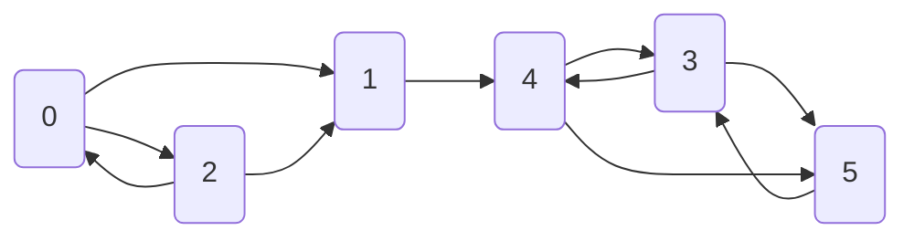

# Chaînes de Markov

## Définition

**Définition** : Une chaîne de Markov homogène à valeurs dans $S$ de matrice de transition $P$ et de loi initial $\lambda$
est une famille de variables aléatoires $(X_n, n \in \mathbb{N})$ telle que :

  1. $\mathbb{P}(X_0 = i) = \lambda_i$
  2. $\mathbb{P}(X_{n+1} = i_{n+1} | X_n = i_n, ..., X_0 = i_0) = \mathbb{P}(X_{n+1} = i_{n+1} | X_n = i_n) = p_{i_n, j_n}$

$(X_n)_{n \in \mathbb{N}}$ est une chaîne de Markov de paramètres $(\lambda, P)$

**Caractérisation** : $(X_n)_{0 \leq n \leq N}$ est Markov $\lambda, P$ ssi pour tous $i_0, ..., i_N$

$$\mathbb{P}(X_0 = 0, ..., X_N = i_N) = \lambda(i_0) p_{i_0, i_1} p_{i_1, i_2} ... p_{i_{N-1},i_N}$$

---
## Conditionnements successifs et calcul

**Propriété** : Si $(X_n)_{0 \leq n \leq N}$ est Markov $(\lambda, P)$, alors, conditionnellement à $X_m = i$, le processus $(X_{m+n}, n \geq 0)$ est Markov  $(\delta_i, P)$ et est indépendant de $(X_0, ..., X_m)$.

On note $\delta_i$ la masse de Dirac en i, et $\mathbb{P}_i$ la loi d'une chaîne $(\delta_i, P)$. On dit que la chaîne est issue de i car $X_0 = i$ p.s.

**Calcul algébrique**

On note une mesure positive $\lambda$ comme un vecteur ligne. $\lambda P$ est la mesure $(\lambda P)(j) = \sum_i \lambda(i) p_{i,j}$. On note $p_{i,j}^{(n)}$ l'élément $i,j$ de la matrice $P^n$. 

**Propriété** : Soit $(X_n)_{n \geq 0}$ Markov $(\lambda, P)$. Alors, pour tout n, la loi de $X_n$ est $\lambda P^n$, i.e.
$$
\mathbb{P}(X_n = j) = (\lambda P^n)(j)
$$

En particulier, pour $\lambda = \delta_i$ et tout $m \geq 0$, on obtient
$$
\mathbb{P}_i(X_n = j)= \mathbb{P}(X_{m+n} = j | X_m = i) = p_{i,j}^n
$$

---
## Etats transients et récurrents

**Définition** 
- On dit que $i$ est transient si $\sum_n p_{ii}^n \lt + \infty$ 
- On dit que $i$ est récurrent si $\sum_n p_{ii}^n \rightarrow + \infty$

On peut alors mettre la matrice de transition sous une forme canonique, avec les états absorbants au début et les états récurrents ensuite :

$$
P=
\left(
\begin{array}{c|c}
Q & R \\
\hline
0 & I
\end{array}
\right)
$$

où $Q^n \rightarrow 0$.

**Propriété** Pour une chaîne de Markov avec un état absorbant, la matrice $I - Q$ est inversible d'inverse $N = \sum_n Q^n$. $n_{ij}$ est le nombre moyen de 
fois où la chaîne est dans l'état $j$ si elle part de l'état $i$.

---
## Mesures invariantes (ou stationnaires)
Propriétés

On dit que la mesure positive $\lambda$ est invariante (ou encore stationnaire) is $\lambda P = \lambda$.

**Proposition** Si $(X_n)_{n \in \mathbb{N}}$ est Markov $(\lambda, P)$ et $\lambda$ est invariante, alors la loi de $X_n$ est
constante et vaut $\lambda$. En outre, pour tout m, $(X_{m+n}, n \geq 0)$ est Markov $(\lambda, P)$.

En particulier, les limites des lois de $X_n$ sont automatiquement des probabilités invariantes sur un espace fini.

**Propriété** On suppose $I$ fini et que pour un $i_0 \in I$, on ait $\forall j, p_{i_0, j}^{(n)} \rightarrow \pi_j$.

Alors $\pi$ est une probabilité invariante.

---
## Théorème ergodique

**Théorème** Soit $X$ une chaîne irréductible positive récurrente. Alors, pour toute fonction $f$ positive 
ou bornée, presque sûrement : 

$$\frac{1}{n} \sum_{k=1}^n f(X_k) \rightarrow \pi(f)$$

---
## Convergence vers l'équilibre

**Théorème** Soit une chaîne de Markov irréductible positive récurrente de probabilité invariante
$\pi$ et apériodique. Alors pour toute loi initiale

$$\mathbb{P}(X_n = i) \rightarrow \pi(i)$$

en particulier, pour tout i, $p_{ij}^{(n)} \rightarrow \pi(j)$.

---
## Les propriétés d'une chaîne de Markov 

**Homogénéité** 

Une chaîne de Markov est homogène si ses probabilités de transitions ne dépendent pas du temps.

**Irréductibilité** 

Une chaîne de Markov est irréductible si chaque état est accessible (en un ou plusieurs pas) depuis chaque état.
C'est à dire qu'il n'y a pas d'état absorbant. Pour un état L'$k$ la probabilité d'atteindre cet état depuis un autre $l \neq k$ est non nulle.

**Récurrence** 

Les états **récurrents** d'une chaîne de markov sont les états visités régulièrement par la chaîne. Si l'espérance du temps de retour, pour un état donné, est borné, l'état est **positivement récurrent**, sinon, l'état est **nullement récurrent**.

Une chaîne est récurrente selon la condition de Harris, si tous les états $X \in S$ de cette chaîne sont visités indéfiniment lorsque $t \rightarrow \infty$. Cette propriété est importante pour les espaces d'états continus et non bornés. Quand la chaîne tend vers un ensemble d'états irréductibles et récurrents selon la condition de Harris, elle y reste et visite tous les états avec une
probabilité de 1.

**Stationnarité** 

Une chaîne de Markov stationnaire a des probabilités de transitions indépendantes du temps. Si $P$ est une matrice $n \times n$ :

$\pi P = \pi$

$\pi$ est alors la distribution limite de la chaîne. _Les méthodes MCMC ont vocation a explorer cette distribution limite. 

**Ergodicité**

L'ergodicité est une propriété des chaînes de Markov irréductibles, apériodiques et récurrentes positivement selon la condition de Harris. L'ergodicité est définie comme

$$\forall \theta_i, \theta_j \in \Theta, \lim\limits_{n \rightarrow \infty} P^{(n)} (\theta_i \rightarrow \theta_j) = \pi(\theta)$$

L'ergodicité est la propriété selon laquelle, à partir d'un certain rang, la chaîne converge vers la distribution stationnaire. 

---
## Application au PageRank

L'algortihme PageRank a emergé à la fin des années 90, sous l'impulsion de Brin et Page, les fondateurs de Google. Contrairement à une recherche thématique ou sémantique classique (bag of words, similarité cosinus, etc.), l'idée de Brin et Page est d'exploiter les liens entre les page web, **un site web étant important s'il est relié à d'autres sites importants**.

Le Page Rank s'appuie sur une marche aléatoire sur les sites webs afin d'estimer le nombre de visites d'une page web.

**Définition**

Soit $X_t$ la page web visitée par une marche aléatoire au pas de temps $t$.

On note $N(i, n)$ le nombre de visites de la page web $i$  pour $t \leq n$. Le **Page Rank** de la page $i$ est définie par se fréquence de visites, dans la limite d'une marche aléatoire infinie :

$$\rho(i) = \lim\limits_{0 \rightarrow \infty} \frac{N(i, n)}{n}$$

La marche aléatoire est définie sur l'ensemble des Page Web. En partant d'une page $i$, l'alogrithme choisi l'un de ses liens sortants de manière équiprobable.

:::{note} Introduction d'un surfeur aléatoire
Le Page Rank s'appuie sur l'idée d'un surfeur aléatoire. Le surfeur aléatoire mime le comportement d'un internaute. Le surfeur circule sur les pages web en cliquant sur les liens hypertextes, et, s'il se retrouve bloqué (page sans liens), il redémarre une recherche depuis la barre URL.

Ainsi, l'algorithme PageRank repart régulièrement d'une page web tirée aléatoirement, afin d'éviter un blocage sur les feuilles du graphe web.
:::

**Exemple**

On donne ci-dessous un exemple de graphe web $G_1$ avec sa matrice de transition $M$ :

$$
M = \left(\begin{array}{rcl}
0 & 1/2 & 1/2 & 0 & 0 & 0\\
0 & 0 & 0 & 0 & 1 & 0\\
1/3 & 1/3 & 0 & 0 & 1/3 \\
0 & 0 & 0 & 0 & 1/2 & 1/2 \\
0 & 0 & 0 & 1/2 & 0 & 1/2 \\
0 & 0 & 0 & 1 & 0 & 0 \\
\end{array}\right)
$$

- Pouvez-vous décrire les limiations de cette modélisation ?
- Comment modifier la matrice de transitions dans le cadre de PageRank ?

---