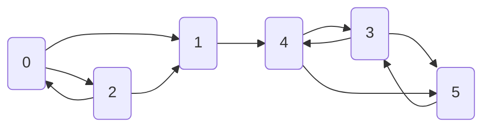

# Définitions

**Définition** : Une chaîne de Markov homogène à valeurs dans $S$ de matrice de transition $P$ et de loi initial $\lambda$
est une famille de variables aléatoires $(X_n, n \in \mathbb{N})$ telle que :

  1. $\mathbb{P}(X_0 = i) = \lambda_i$
  2. $\mathbb{P}(X_{n+1} = i_{n+1} | X_n = i_n, ..., X_0 = i_0) = \mathbb{P}(X_{n+1} = i_{n+1} | X_n = i_n) = p_{i_n, j_n}$

$(X_n)_{n \in \mathbb{N}}$ est une chaîne de Markov de paramètres $(\lambda, P)$

**Caractérisation** : $(X_n)_{0 \leq n \leq N}$ est Markov $\lambda, P$ ssi pour tous $i_0, ..., i_N$

$$\mathbb{P}(X_0 = 0, ..., X_N = i_N) = \lambda(i_0) p_{i_0, i_1} p_{i_1, i_2} ... p_{i_{N-1},i_N}$$

## Conditionnements successifs et calcul

**Propriété** : Si $(X_n)_{0 \leq n \leq N}$ est Markov $(\lambda, P)$, alors, conditionnellement à $X_m = i$, le processus $(X_{m+n}, n \geq 0)$ est Markov  $(\delta_i, P)$ et est indépendant de $(X_0, ..., X_m)$.

On note $\delta_i$ la masse de Dirac en i, et $\mathbb{P}_i$ la loi d'une chaîne $(\delta_i, P)$. On dit que la chaîne est issue de i car $X_0 = i$ p.s.

**Calcul algébrique**

On note une mesure positive $\lambda$ comme un vecteur ligne. $\lambda P$ est la mesure $(\lambda P)(j) = \sum_i \lambda(i) p_{i,j}$. On note $p_{i,j}^{(n)}$ l'élément $i,j$ de la matrice $P^n$. 

**Propriété** : Soit $(X_n)_{n \geq 0}$ Markov $(\lambda, P)$. Alors, pour tout n, la loi de $X_n$ est $\lambda P^n$, i.e.
$$
\mathbb{P}(X_n = j) = (\lambda P^n)(j)
$$

En particulier, pour $\lambda = \delta_i$ et tout $m \geq 0$, on obtient
$$
\mathbb{P}_i(X_n = j)= \mathbb{P}(X_{m+n} = j | X_m = i) = p_{i,j}^n
$$

## Etats transients et récurrents

**Définition** 
- On dit que $i$ est transient si $\sum_n p_{ii}^n \lt + \infty$ 
- On dit que $i$ est récurrent si $\sum_n p_{ii}^n \rightarrow + \infty$

On peut alors mettre la matrice de transition sous une forme canonique, avec les états absorbants au début et les états récurrents ensuite :

$$
P=
\left(
\begin{array}{c|c}
Q & R \\
0 & I
\end{array}
\right)
$$

où $Q^n \rightarrow 0$.

**Propriété** Pour une chaîne de Markov avec un état absorbant, la matrice $I - Q$ est inversible d'inverse $N = \sum_n Q^n$. $n_{ij}$ est le nombre moyen de 
fois où la chaîne est dans l'état $j$ si elle part de l'état $i$.

## Mesures invariantes (ou stationnaires)
Propriétés

On dit que la mesure positive $\lambda$ est invariante (ou encore stationnaire) is $\lambda P = \lambda$.

**Proposition** Si $(X_n)_{n \in \mathbb{N}}$ est Markov $(\lambda, P)$ et $\lambda$ est invariante, alors la loi de $X_n$ est
constante et vaut $\lambda$. En outre, pour tout m, $(X_{m+n}, n \geq 0)$ est Markov $(\lambda, P)$.

En particulier, les limites des lois de $X_n$ sont automatiquement des probabilités invariantes sur un espace fini.

**Propriété** On suppose $I$ fini et que pour un $i_0 \in I$, on ait $\forall j, p_{i_0, j}^{(n)} \rightarrow \pi_j$.

Alors $\pi$ est une probabilité invariante.

# Propriétés d'une chaîne de Markov

## Théorème ergodique

**Théorème** Soit $X$ une chaîne irréductible positive récurrente. Alors, pour toute fonction $f$ positive 
ou bornée, presque sûrement : 

$$\frac{1}{n} \sum_{k=1}^n f(X_k) \rightarrow \pi(f)$$

## Convergence vers l'équilibre

**Théorème** Soit une chaîne de Markov irréductible positive récurrente de probabilité invariante
$\pi$ et apériodique. Alors pour toute loi initiale

$$\mathbb{P}(X_n = i) \rightarrow \pi(i)$$

en particulier, pour tout i, $p_{ij}^{(n)} \rightarrow \pi(j)$.

## Caractéristiques d'une chaîne de Markov 

**Homogénéité** 

Une chaîne de Markov est homogène si ses probabilités de transitions ne dépendent pas du temps.

**Irréductibilité** 

Une chaîne de Markov est irréductible si chaque état est accessible (en un ou plusieurs pas) depuis chaque état.
C'est à dire qu'il n'y a pas d'état absorbant. Pour un état L'$k$ la probabilité d'atteindre cet état depuis un autre $l \neq k$ est non nulle.

**Récurrence** 

Les états **récurrents** d'une chaîne de markov sont les états visités régulièrement par la chaîne. Si l'espérance du temps de retour, pour un état donné, est borné, l'état est **positivement récurrent**, sinon, l'état est **nullement récurrent**.

Une chaîne est récurrente selon la condition de Harris, si tous les états $X \in S$ de cette chaîne sont visités indéfiniment lorsque $t \rightarrow \infty$. Cette propriété est importante pour les espaces d'états continus et non bornés. Quand la chaîne tend vers un ensemble d'états irréductibles et récurrents selon la condition de Harris, elle y reste et visite tous les états avec une
probabilité de 1.

**Stationnarité** 

Une chaîne de Markov stationnaire a des probabilités de transitions indépendantes du temps. Si $P$ est une matrice $n \times n$ :

$\pi P = \pi$

$\pi$ est alors la distribution limite de la chaîne. _Les méthodes MCMC ont vocation a explorer cette distribution limite. 

**Ergodicité**

L'ergodicité est une propriété des chaînes de Markov irréductibles, apériodiques et récurrentes positivement selon la condition de Harris. L'ergodicité est définie comme

$$\forall \theta_i, \theta_j \in \Theta, \lim\limits_{n \rightarrow \infty} P^{(n)} (\theta_i \rightarrow \theta_j) = \pi(\theta)$$

L'ergodicité est la propriété selon laquelle, à partir d'un certain rang, la chaîne converge vers la distribution stationnaire. 

# Application au PageRank

L'algortihme PageRank a emergé à la fin des années 90, sous l'impulsion de Brin et Page, les fondateurs de Google. Contrairement à une recherche thématique ou sémantique classique (bag of words, similarité cosinus, etc.), l'idée de Brin et Page est d'exploiter les liens hypertextes entre les pages web.

Le Page Rank s'appuie sur une marche aléatoire sur les sites webs afin d'estimer le nombre de visites d'une page web.

**Définition**

Soit $X_t$ la page web visitée par une marche aléatoire au pas de temps $t$.

On note $N(i, n)$ le nombre de visites de la page web $i$  pour $t \leq n$. Le **Page Rank** de la page $i$ est définie par se fréquence de visites, dans la limite d'une marche aléatoire infinie :

$$\rho(i) = \lim\limits_{0 \rightarrow \infty} \frac{N(i, n)}{n}$$

La marche aléatoire est définie sur l'ensemble des Page Web. En partant d'une page $i$, l'alogrithme choisi l'un de ses liens sortants de manière équiprobable.

:::{note} Introduction d'un surfeur aléatoire
Le Page Rank s'appuie sur l'idée d'un surfeur aléatoire. Le surfeur aléatoire mime le comportement d'un internaute. Le surfeur circule sur les pages web en cliquant sur les liens hypertextes, et, s'il se retrouve bloqué (page sans liens), il redémarre une recherche depuis la barre URL.

Ainsi, l'algorithme PageRank repart régulièrement d'une page web tirée aléatoirement, afin d'éviter un blocage sur les feuilles du graphe web.
:::

**Exemple**

On donne ci-dessous un exemple de graphe web $G_1$ avec sa matrice de transition $M$ :

$$
M = \left(\begin{array}{rcl}
0 & 1/2 & 1/2 & 0 & 0 & 0\\
0 & 0 & 0 & 0 & 1 & 0\\
1/3 & 1/3 & 0 & 0 & 1/3 \\
0 & 0 & 0 & 0 & 1/2 & 1/2 \\
0 & 0 & 0 & 1/2 & 0 & 1/2 \\
0 & 0 & 0 & 1 & 0 & 0 \\
\end{array}\right)
$$

- Pouvez-vous décrire les limiations de cette modélisation ?
- Comment modifier la matrice de transitions dans le cadre de PageRank ?

# Vers un espace d'états continu

todo : exemples espace d'état continu

# Vers une modélisation en temps continu : Chapman-Kolmogorov

todo : exemples temps continu

$\rightarrow$ Comment construire un estimateur quand on ne connaît plus la structure du bruit ?

# Méthodes de Monte-Carlo pour l'estimation d'une chaîne de Markov

**Méthodes de Monte-Carlo** : échantillonnage d'une densité de probabilité par tirages. 

:::{note} Estimation des moments d'une distribution
Une fois que l'on a accès à une estimation de la densité de probabilité, nous pouvons déduire les moments de la distribution, notamment la moyenne et la variance.
:::

**Chaînes de Markov** : processus stochastique dont la transition entre 2 états $x_{n-1} \rightarrow x_{n}$ ne dépend que de l'état précédent $x_{n-1}$.

:::{note} Liens avec le Filte de Kalman
Le filtre Kalman est un exemple de chaîne de Markov.
:::

## Vers le Filtre Kalman d'Ensemble

:::{note}
Ce chapitre est indépendant de celui sur le Filtrage Kalman. Mais il va nus permettre de définir une autre méthode de calcul des matrices de covariance 
pour le filtre Kalman.
:::

$\rightarrow$ Les 2 sont utilisés en **Assimilation de données** pour établir le filtre de Kalman d'ensemble (EnKF), avec :

1. **Une composante de filtrage** : Comment recaler un modèle par rapport aux observations / mesures ?
2. **Une composante d'échantillonage** : Comment estimer la dispersion du modèle ?

## Echantillonnage d'une chaîne de Markov par Méthodes de Monte-Carlo (MCMC)

$\rightarrow$ Pourquoi utiliser les méthodes de Monte-Carlo sur des chaînes de Markov ?

- Apprendre une distribution, un processus stochastique par échantillonage aléatoire. 
- Très utile sur des systèmes "en boîte noire" pour lesquels il existe des réalisations (ou des simulations).
- Efficace sur des problèmes de grandes dimensions _(dont la combinatoire est trop grande pour des méthodes classiques)_.

## Historique et applications

- Expérience des Aiguilles de Buffon (1733) : Estimation de $\pi$ par le compte de Buffon.
- Projet Manhattan (1940) :  utilisation des premiers ordinateurs pour la simulation de processus physiques, lors de la construction de la bombe atomique.

Les Méthodes de Monte-Carlo se développent avec l'augmentation des puissances de calcul, avec, en particulier, quelques applications remarquables : 
- PageRank : estimation du poids d'une page web par échantillonage sur ses liens sortants,
- AlphaGo : (Monte-Carlo Tree Search), estimation du meilleur coup par échantillonage des différentes trajectoires possibles.

# Méthodes de Monte-Carlo

## Construction de l'estimateur

**Estimateur de Monte-Carlo** Pour une suite de variables aléatoires indépendantes, identiquement distribuées, $\{q_1, ..., q_N\}$ (N arbitrairement grand), et pour une fonction $f$ à valeurs réelles et mesurables, les estimateur de Monte-Carlo sont défini par les **moyennes d'ensemble** de $f$ :

$$\hat{f}_N^{MC} = \frac{1}{N} \sum_{n=1}^N f(q_n)$$

La moyenne de l'ensemble converge alors vers l'espérance de $f$ :

$$\lim_{N \rightarrow \infty} \hat{f}_{N}^{MC} = \mathbb{E}_{\pi}[f]$$

Formellement, la variable aléatoire définie par la moyenne d'ensemble $\hat{f}_N^{MC}$ tend vers une distribution de Dirac autour de l'espérance de la fonction : $\lim_{N \rightarrow \infty} \hat{f}_{N}^{MC} = \delta_{\mathbb{E}_{\pi}[f]}$.

## Erreur de l'estimateur

**Propriété** : L'estimateur défini est assymptotiquement sans biais.

$\rightarrow$ En pratique, on cherche à estimer l'exactitude de l'estimateur pour un petit échantillon _(afin d'utiliser ces méthodes sur des ressources de calcul limitées)_.

**Propriété** : L'estimateur de Monte-Carlo, pour une fonction réelle et de carré intégrable (pour laquelle $\mathbb{E}_{\pi}[f], \mathbb{E}_{\pi}[f]$ existent), satisfait le Théorème Central Limite. 
C'est-à-dire, la suite des estimateurs de Monte-Carlo standardisés converge vers une loi normale centrée réduite.

$$\lim_{N \rightarrow \infty} \frac{\hat{f}_N^{MC} - \mathbb{E}_{\pi}[f]}{SE_{N}} \sim \mathcal{N}(0,1)$$

où $SE_N$ est l'erreur quadratique de l'estiamteur de Monte-Carlo : $SE_N = \sqrt{\frac{Var_{\pi}[f]}{N}}$

## En bref 

Autrement dit, à la limite,

$$\hat{f}_N^{MC} = \mathcal{N}(\mathbb{E}_{\pi}[f], SE_N[f])$$

En pratique, la quantification de l'erreur par le TCL suppose de connaître la variance $Var_{\pi}[f]$. Si $f^2$ est de carré intégrable ($\mathbb{E}[f^4]$ existe), on peut approximer la variance par un autre estimateur de Monte-Carlo.

**Avantages** : $SE_N \propto \frac{1}{\sqrt{N}}$, l'erreur quadratique moyenne décroît avec l'inverse de la racine carrée de la taille de l'échantillon. En pratique, cela permet de dimensionnner au préalable le nombre d'échantillons nécessaires pour atteindre une erreur donnée. 

**Limitations** : la quantification de l'erreur est probabiliste. Il reste toujours une (mal)-chance que l'estimateur s'échoue dans la queue de la distribution (ex : $\hat{f}_N^{MC} > \mathbb{E}_{\pi}[f] + 3 SE_N[f   ]$).

# Distribution stationnaire d'une chaîne de Markov

$\rightarrow$ But : on cherche à explorer une distribution cible $\pi$.

**Définition** : Sur un espace d'états $Q$, une chaîne de Markov est définie comme une suite de transitions entre états ${q_1, ..., q_N}$ dont la transition entre 2 états $q_n \rightarrow q_{n+1}$ ne
dépend que de l'état $q_n$.

$$P(q_{n+1} | q_1, ..., q_n) = P(q_{n+1} | q_n)$$

**Application** : Une chaîne de Markov permet d'échantillonner des chemins discrets sur un espace ambient (à explorer). La mise au point d'une chaîne de Markov sur cet espace permet d'identifier une distribution cible $\pi$.

**Distribution de transitions** : Soit un espace ambient $Q$ équipé d'une tribu (ou $\sigma$-algèbre) $\mathcal{Q}$. On peut spécifier les **transitions de Markov** comme une densité de probabilité conditionnelle :

$$
\begin{array}{rcl}
T \colon &Q \times Q \rightarrow \mathbb{R}^+\\
&(q, q') \mapsto T(q'| q)
\end{array}
$$

pour une transition de $q$ vers $q'$.

Etant donné un point $q_0$, un tirage aléatoire de $T(\cdot | q_0)$ forme un **saut** ou une **transition**.

$$\bar{q}_1 \sim T(q_1 | q_0)$$

En itérant ces tirages aléatoires, on réalise (ou simule) une trajectoire $\{\bar{q}_1, ..., \bar{q}_n\}$ où

$$
\begin{array}{rcl}
&\bar{q}_1 \sim T(q_1 | q_0)\\
&...\\
&\bar{q}_N \sim T(q_N | q_{N-1})\\
\end{array}
$$

$\rightarrow$ On génère des séquences de points corrélés. 

:::{note} Corrélations
Ici, on génère une séquence de points corrélés, au contraire d'un échantillonnage par méthodes de Monte-Carlo où les points sont des réalisations de variables indépendantes et identiquement distribuées.
:::

## Exemple : trajectoire sur un espace à 2 dimensions

On se dote d'un espace ambient à 2 dimensions $Q = \mathbb{R}^2$, avec 2 fonctions de coordonnées :
$$
\begin{array}{rcl}
\omega_1 \colon& Q \rightarrow \mathbb{R}\\
& q \mapsto q^1
\end{array}|
\begin{array}{rcl}
\omega_2 \colon& Q \rightarrow \mathbb{R}\\
& q \mapsto q^2
\end{array}
$$

On définit une densité de probabilité de transition de Markov :
$$
T(q_1 | q_0) = \mathcal{N}(q_1^1|q_0^1, \sigma) \mathcal{N}(q_1^2|q_0^2, \sigma)
$$

_A gauche : Réalisation d'une trajectoire d'une chaîne de Markov, [Markov Chain Monte Carlo in Practice, M. Betancourt](https://betanalpha.github.io/assets/case_studies/markov_chain_monte_carlo.html#2_markov_chain_of_command)_ 

## Distribution stationnaire (ou invariante)

**Résultat empirique** : la réalisation d'une chaîne de Markov converge vers une distribution invariante par transitions de Markov, **la distribution stationnaire**, pour une distribution de transitions donnée $T('q|q')$.

$$\pi = \int dq' \pi(q') T(q | q')$$

**Application** 

En reprenant le **problème de marginalisation** $P(data) = ?$, si nous arrivons à construire une chaîne de Markov dont la distribtion stationnaire est celle des données ($\pi = P(data)$), alors nous 
pouvons construire un estimateur de manière analogue à celui de Monte-Carlo.

## Stationnarité - Démonstration

Construisons les densités de probabilités rencontrées sur le chemin formé par la chaîne de Markov :

1. $\bar{q}_0 \sim \rho$. On définit la distribution initiale $\rho = \delta_{q_0}$ (distribution de Dirac autour de $q_0$, le point initial est $q_0$ presque sûrement).

2. L'espérance de la position du point 1 est donnée par :
  $$(T\rho)(q_1) = \int dq_0 T(q_1|q_0)\rho(q_0)$$

3. En itérant au point 2, puis au point n :
  $$(T^2 \rho)(q_2) = (T \cdot T\rho)(q_2) = \int dq_1 dq_2 T(q_2|q_1)T(q_1|q_0)\rho(q_0)$$
  $$(T^N \rho)(q_N) = (T \cdot T^{N-1}\rho)(q_{N-1}) = (T \cdot ... \cdot T \rho)(q_N)$$

En consruisant la densité de probabilité au point $N$ :
  $$(T^N \rho)(q_N) = (T \cdot T^{N-1}\rho)(q_{N-1}) = (T \cdot ... \cdot T \rho)(q_N)$$

En observant la convergence, **si la limite existe**, 

$$\lim_{N \rightarrow \infty} T^N \rho = \pi$$

Alors c'est un point fixe :

$$T\pi = \pi$$

:::{note} Existence de la limite 
Ce qu'on vient d'énoncer ne présage pas de l'existance de la limite. Simplement, si elle exite alors c'est une distribution stationnaire. En pratique, on construit une chaîne de Markov et ses transitions pour qu'elle tende une distribution limite stationnaire.
:::

## Stationnarité - Illustration

_Source : [Markov Chain Monte Carlo in Practice, M. Betancourt](https://betanalpha.github.io/assets/case_studies/markov_chain_monte_carlo.html#2_markov_chain_of_command)_ 

## (Optionnel) Vitesses de convergence

**Convergence** : Etant donné une distance $„”| \cdot | $, la chaîne de Markov converge si $\forall \epsilon \in \mathbb{R}^+, \exists N(\rho) \in \mathbb{N}$ tel que 
$$| T^N \rho - \pi | \leq \epsilon$$

**Distance en variations totales** : 
$| \rho - \pi |_{TV} = sup_{B \in \mathcal{Q}}  |\rho[B] - \pi[B]|$

**Vitesses de convergence**

- Ergodicité polynômiale  : $| \rho - \pi |_{TV} \leq C(\rho)(N + 1)^{-\beta}$
- Ergodicité géométrique  : $| \rho - \pi |_{TV} \leq C(\rho)r^N$
- Ergodicité uniforme : $| \rho - \pi |_{TV} \leq C r^N$

:::{note} Convergence rapide
L'ergodicité uniforme permet la convergence rapuide (en un nombre limité d'opérations), mais est typiqueemnt réservée aux espaces bornés.
:::

# Estimateur Markov Chain Monte-Carlo (MCMC)
## Construction de l'estimateur

**Estimateur MCMC** Etant donné une suite de points $\{q_1, ..., q_N\}$ qui forment la réalisation d'une chaîne de Markov, l'estimateur **Markov Chain Monte-Carlo** est défini par 

$$\hat{f}_N^{MCMC} = \frac{1}{N + 1} \sum_{n=0}^{N} f(q_n)$$

Contrairement aux estimateurs de Monte-Carlo (MC), le comportement assymptotique des estimateurs MCMC n'est pas défini

$$\lim_{N \rightarrow \infty} \pi_{f_N^{MCMC}} = \delta_{\mathbb{E}_{\pi}[f]}$$

## Conditions de convergence 

### Nombre d'itérations infinies

La convergence des estimateurs MCMC est garantie à condition que **la chaîne soit récurrente**.
Dans ce cas, la limite existe seulement pour **un nombre fini d'initialisations**.

$$\lim_{N \rightarrow \infty}  \pi_{f_N^{MCMC}} = \delta_{\mathbb{E}_{\pi}[f]} $$

Ce résultat peut être généralisé à toute distribution initale de points par la **condition de Harris**.

**Chaîne de Markov récurrente** : La chaîne est irréductible selon des transitions de Markov sont **apériodiques** et **irréductible**.

**Chaîne de Harris** :  chaîne de Markov dont la chaîne retourne **un nombre non-borné de fois** dans une partie quelconque de l'espace d'états.

:::{note} Hypothèses de l'estimateur MCMC
En pratique, construire ou utiliser un estimateur **MCMC** nécessite de vérifier précautionneusement les hypothèses sur les transitions de la chaîne de Markov.
:::

### Nombre d'itérations fini

Nous venons d'étudier le comportement assymptotique d'un estimateur **MCMC**, c'est-à-dire en nombre d'itérations infini.

$\rightarrow$ En pratique, qu'en est il de la convergence en nombre d'itérations finies ?

_todo : section à finir_

## Illustrations 

### Cas stable

_Source : [Markov Chain Monte Carlo in Practice, M. Betancourt](https://betanalpha.github.io/assets/case_studies/markov_chain_monte_carlo.html#2_markov_chain_of_command)_

### Cas instables

_Source : [Markov Chain Monte Carlo in Practice, M. Betancourt](https://betanalpha.github.io/assets/case_studies/markov_chain_monte_carlo.html#2_markov_chain_of_command)_

### Cas instables

_Source : [Markov Chain Monte Carlo in Practice, M. Betancourt](https://betanalpha.github.io/assets/case_studies/markov_chain_monte_carlo.html#2_markov_chain_of_command)_

## Convergence : MCMC et Théorème Central Limite

$\rightarrow$ En pratique, la convergence dépend beaucoup de la distribution à explorer.

Ces méthodes, bien qu'utiles, sont moins robustes que les méthodes de Monte-Carlo. Elles dépendent grandement du jeu de données à explorer et nécessitent une mise au point minutieuse.

Le Théorème Central Limite s'applique pour des conditions particulières d'estimateurs MCMC. 

Si on considère un fonction de carré intégrable $f \colon Q \mapsto \mathbb{R}$. On suppose que la distribution de porbabilité des transitions satisfait le Théorème Central Limite. Dans ce cas, à partir d'un certain rang, suffisament long, la chaîne de Markov peut être apporximée à une Gaussienne :
$$\hat{f}_N^{MCMC} \sim \mathcal{N}(\mathbb{E}[f], MCMC-SE[f])$$

où MCMC-SE (_Markov Chain Monte Carlo Standard Error_) est définie par :
$$
MCMC-SE[f] = \sqrt{\frac{Var[f]}{\lambda[f] \cdot N}}
$$ 

:::{note} Avantages de l'estimateur MCMC par rapport à une méthode de Monte-Carlo
Selon le terme $\lambda[f] \cdot N$, la décroissance de l'erreur pour un estimateur MCMC peut être plus rapide que celle d'un estimateur de Monte-Carlo.
:::

# Algorithme de Metropolis-Hastings

**Implémentation** : Comment construire les distributions de transitions pour obtenir une Chaîne de Markov qui converge vers une distribution stationnaire ?

**L'Algorithme de Métropolis-Hastings** propose une approche générique par essais / erreurs. 

1. On définit une distribution à priori pour définir les probabilités de transition :
$$
\begin{array}{rcl}
K \colon &Q \times Q \rightarrow \mathbb{R}^+\\
&(q, q') \mapsto K(q'| q)
\end{array}
$$

**L'Algorithme de Métropolis-Hastings** propose une approche générique par essais / erreurs. 

2. Pour une transition entre $q$ et $q'$, on définit la probabilité d'acceptation _(acceptance probability)_ de Metropolis-Hastings
$$
a(q',q) = min(1, \frac{K(q|q')\pi(q')}{K(q'|q)\pi(q)})
$$

avec $\frac{\pi(q')}{\pi(q)}$ le _ratio de Metropolis_, et $\frac{K(q|q')}{K(q'|q)}$ la _correction d'Hastings_

3. La _transition de Métropolis_ est définie comme la probabilité de sauter vers la proposition $q'$ avec une probabilité $a(q',q)$ et de rester au point initial avec la probabilité $1 - a(q',q)$

La distribution des transitions de Markov peut être définie comme :

$$T(q'|q) = a(q', q) \cdot Q(q'|q) + (1 - \in dq' Q(q'|q)a(q|q')) \cdot \delta(q - q') $$

## Random Walk Metropolis

Dans ce cas, $Q(q'|q, \Sigma) = \mathcal{N}(q'|q, \Sigma)$
On perturbe le point initial par une gaussienne.

# Références

[Markov Chain Monte Carlo in Practice, M. Betancourt](https://betanalpha.github.io/assets/case_studies/markov_chain_monte_carlo.html#2_markov_chain_of_command)

[Compound extremes in a changing climate –
a Markov chain approach](https://npg.copernicus.org/articles/23/375/2016/npg-23-375-2016.pdf)

[Algorithme de Métropolis-Hastings](https://perso.lpsm.paris/~vlemaire/4ma074/cours/metropolis.html)

[Processus Stochastiques, Notes de cours, P. Carmona](https://philcarmona.github.io/extra/cecn4.pdf)

[CS168: The Modern Algorithmic Toolbox
Lecture #14: Markov Chain Monte Carlo](https://web.stanford.edu/class/cs168/l/l14.pdf)

