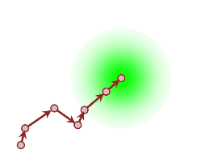
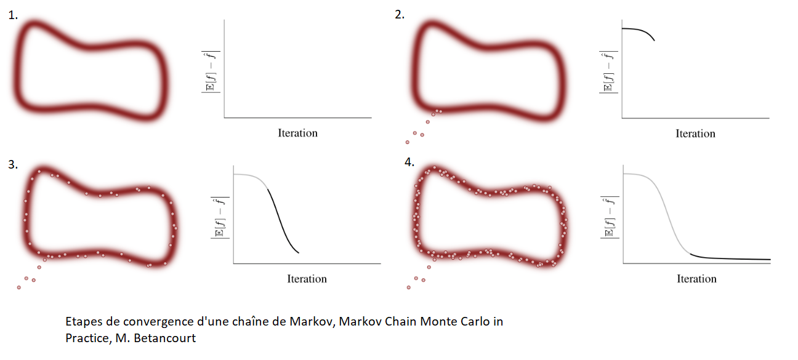
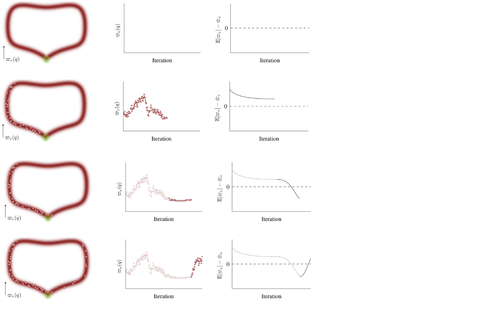

# Markov Chain Monte Carlo

## Au cours précédent

**Filtre de Kalman** : la fermeture du système d'équations du filtre s'effectue grâce aux propriétés gaussiennes des bruits d'état et de mesure. On peut ainsi se limiter à construire **l'évolution de la moyenne et de la variance** de l'estimateur.

$\rightarrow$ Comment construire un estimateur quand on ne connaît plus la structure du bruit ?

---
## Chaînes de Markov et  Méthodes de Monte-Carlo

**Méthodes de Monte-Carlo** : estimation d'une densité de probabilité par tirages. 

_Remarque : Une fois que l'on a accès à une estimation de la densité de probabilité, nous pouvons déduire les moments de la distribution, notamment la moyenne et la variance._

**Chaînes de Markov** : processus stochastique dont la transition entre 2 états $x_{n-1} \rightarrow x_{n}$ ne dépend que de l'état précédent $x_{n-1}$.

_Remarque : Le filtre Kalman entre dans le cadre des chaînes de Markov_.

---
## Vers le Filtre Kalman d'Ensemble

_Remarque : Ce cours est indépendant de celui sur le Filtrage Kalman. Mais il va nus permettre de définir une autre méthode de calcul des matrices de covariance 
pour le filtre Kalman._

$\rightarrow$ Le Filtre de Kalman et les Chaînes de Markov sont 2 représentants de Processus Stochastiques

$\rightarrow$ Les 2 sont utilisés en **Assimilation de données** pour établir le filtre de Kalman d'ensemble (EnKF), avec :

1. **Une composante de filtrage** :

    _Comment recaler un modèle par rapport aux observations / mesures_ ?

2. **Une composante d'échantillonage** :

    _Comment estimer la dispersion du modèle_ ?

---
# Markov Chain Monte-Carlo
MCMC

$\rightarrow$ Pourquoi utiliser les méthodes de Monte-Carlo sur des chaînes de Markov ?

- Apprendre une distribution, un processus stochastique par échantillonage aléatoire. 
- Très utile sur des systèmes "en boîte noire" pour lesquels il existe des réalisations (ou des simulations).
- Efficace sur des problèmes de grandes dimensions _(dont la combinatoire est trop grande pour des méthodes classiques)_.

---
# Historique et applications

- Aiguilles de Buffon (1733) : Estimation de $\pi$ par le compte de Buffon.
- Projet Manhattan (1940) :  utilisation des premiers ordinateurs pour la simulation de processus physiques, lors de la construction de la bombe atomique.

$\rightarrow$ Les Méthodes de Monte-Carlo se développent avec l'augmentation des puissances de calcul, avec, en particulier, quelques applications remarquables : 

- PageRank : estimation du poids d'une page web par échantillonage sur ses liens sortants,

- AlphaGo : (Monte-Carlo Tree Search), estimation du meilleur coup par échantillonage des différentes trajectoires possibles.

---
# Méthodes de Monte-Carlo

## Construction de l'estimateur

**Estimateur de Monte-Carlo** Pour une suite de variables aléatoires indépendantes, identiquement distribuées, $\{q_1, ..., q_N\}$ (N arbitrairement grand), et pour une fonction $f$ à valeurs réelles et mesurables, les estimateur de Monte-Carlo sont défini par les **moyennes d'ensemble** de $f$ :

$$\hat{f}_N^{MC} = \frac{1}{N} \sum_{n=1}^N f(q_n)$$

La moyenne de l'ensemble converge alors vers l'espérance de $f$ :

$$\lim\limits_{N \rightarrow \infty} \hat{f}_{N}^{MC} = \mathbb{E}_{\pi}[f]$$

Formellement, la variable aléatoire définie par la moyenne d'ensemble $\hat{f}_N^{MC}$ tend vers une distribution de Dirac autour de l'espérance de la fonction : $\lim\limits_{N \rightarrow \infty} \hat{f}_{N}^{MC} = \delta_{\mathbb{E}_{\pi}[f]}$.

---
## Erreur de l'estimateur

**Propriété** : L'estimateur défini est assymptotiquement sans biais.

$\rightarrow$ En pratique, on cherche à estimer l'exactitude de l'estimateur pour un petit échantillon _(afin d'utiliser ces méthodes sur des ressources de calcul limitées)_.

**Propriété** : L'estimateur de Monte-Carlo, pour une fonction réelle et de carré intégrable (pour laquelle $\mathbb{E}_{\pi}[f], \mathbb{E}_{\pi}[f]$ existent), satisfait le Théorème Central Limite. 
C'est-à-dire, la suite des estimateurs de Monte-Carlo standardisés converge vers une loi normale centrée réduite.

$$\lim\limits_{N \rightarrow \infty} \frac{\hat{f}_N^{MC} - \mathbb{E}_{\pi}[f]}{SE_{N}} \sim \mathcal{N}(0,1)$$

où $SE_N$ est l'erreur quadratique de l'estiamteur de Monte-Carlo : $SE_N = \sqrt{\frac{Var_{\pi}[f]}{N}}$

---
## En bref 

Autrement dit, à la limite,

$$\hat{f}_N^{MC} = \mathcal{N}(\mathbb{E}_{\pi}[f], SE_N[f])$$

En pratique, la quantification de l'erreur par le TCL suppose de connaître la variance $Var_{\pi}[f]$. Si $f^2$ est de carré intégrable ($\mathbb{E}[f^4]$ existe), on peut approximer la variance par un autre estimateur de Monte-Carlo.

**Avantages** : $SE_N \propto \frac{1}{\sqrt{N}}$, l'erreur quadratique moyenne décroît avec l'inverse de la racine carrée de la taille de l'échantillon. En pratique, cela permet de dimensionnner au préalable le nombre d'échantillons nécessaires pour atteindre une erreur donnée. 

**Limitations** : la quantification de l'erreur est probabiliste. Il reste toujours une (mal)-chance que l'estimateur s'échoue dans la queue de la distribution (ex : $\hat{f}_N^{MC} > \mathbb{E}_{\pi}[f] + 3 SE_N[f   ]$).

---
# Chaînes de Markov

$\rightarrow$ But : on cherche à explorer une distribution cible $\pi$.

**Définition** : Sur un espace d'états $Q$, une chaîne de Markov est définie comme une suite de transitions entre états ${q_1, ..., q_N}$ dont la transition entre 2 états $q_n \rightarrow q_{n+1}$ ne
dépend que de l'état $q_n$.

$$P(q_{n+1} | q_1, ..., q_n) = P(q_{n+1} | q_n)$$

**Application** : Une chaîne de Markov permet d'échantillonner des chemins discrets sur un espace ambient (à explorer). La mise au point d'une chaîne de Markov sur cet espace permet d'identifier une distribution cible $\pi$.

**Distribution de transitions** : Soit un espace ambient $Q$ équipé d'une tribu (ou $\sigma$-algèbre) $\mathcal{Q}$. On peut spécifier les **transitions de Markov** comme une densité de probabilité conditionnelle :

$$
\begin{array}{rcl}
T \colon &Q \times Q \rightarrow \mathbb{R}^+\\
&(q, q') \mapsto T(q'| q)
\end{array}
$$

pour une transition de $q$ vers $q'$.

Etant donné un point $q_0$, un tirage aléatoire de $T(\cdot | q_0)$ forme un **saut** ou une **transition**.

$$\bar{q}_1 \sim T(q_1 | q_0)$$

En itérant ces tirages aléatoires, on réalise (ou simule) une trajectoire $\{\bar{q}_1, ..., \bar{q}_n\}$ où

$$
\begin{array}{rcl}
&\bar{q}_1 \sim T(q_1 | q_0)\\
&...\\
&\bar{q}_N \sim T(q_N | q_{N-1})\\
\end{array}
$$

$\rightarrow$ On génère des séquences de points corrélés. 

_(Au contraire des tirages i.i.d. effectués pour les Méthodes de Monte-Carlo)_.

---
## Exemple : trajectoire sur un espace à 2 dimensions

On se dote d'un espace ambient à 2 dimensions $Q = \mathbb{R}^2$, avec 2 fonctions de coordonnées :
$$
\begin{array}{rcl}
\omega_1 \colon& Q \rightarrow \mathbb{R}\\
& q \mapsto q^1
\end{array}|
\begin{array}{rcl}
\omega_2 \colon& Q \rightarrow \mathbb{R}\\
& q \mapsto q^2
\end{array}
$$

On définit une densité de probabilité de transition de Markov :
$$
T(q_1 | q_0) = \mathcal{N}(q_1^1|q_0^1, \sigma) \mathcal{N}(q_1^2|q_0^2, \sigma)
$$

_A gauche : Réalisation d'une trajectoire d'une chaîne de Markov, [Markov Chain Monte Carlo in Practice, M. Betancourt](https://betanalpha.github.io/assets/case_studies/markov_chain_monte_carlo.html#2_markov_chain_of_command)_ 

---
## Distribution stationnaire (ou invariante)

**Résultat empirique** : la réalisation d'une chaîne de Markov converge vers une distribution invariante par transitions de Markov, **la distribution stationnaire**, pour une distribution de transitions donnée $T('q|q')$.

$$\pi = \int dq' \pi(q') T(q | q')$$

**Application** 

En reprenant le **problème de marginalisation** $P(data) = ?$, si nous arrivons à construire une chaîne de Markov dont la distribtion stationnaire est celle des données ($\pi = P(data)$), alors nous 
pouvons construire un estimateur de manière analogue à celui de Monte-Carlo.

---
## Stationnarité - Démonstration

Construisons les densités de probabilités rencontrées sur le chemin formé par la chaîne de Markov :

1. $\bar{q}_0 \sim \rho$. On définit la distribution initiale $\rho = \delta_{q_0}$ (distribution de Dirac autour de $q_0$, le point initial est $q_0$ presque sûrement).

2. L'espérance de la position du point 1 est donnée par :
  $$(T\rho)(q_1) = \int dq_0 T(q_1|q_0)\rho(q_0)$$

3. En itérant au point 2, puis au point n :
  $$(T^2 \rho)(q_2) = (T \cdot T\rho)(q_2) = \int dq_1 dq_2 T(q_2|q_1)T(q_1|q_0)\rho(q_0)$$
  $$(T^N \rho)(q_N) = (T \cdot T^{N-1}\rho)(q_{N-1}) = (T \cdot ... \cdot T \rho)(q_N)$$

En consruisant la densité de probabilité au point $N$ :
  $$(T^N \rho)(q_N) = (T \cdot T^{N-1}\rho)(q_{N-1}) = (T \cdot ... \cdot T \rho)(q_N)$$

En observant la convergence, **si la limite existe**, 

$$\lim\limits_{N \rightarrow \infty} T^N \rho = \pi$$

Alors c'est un point fixe :

$$T\pi = \pi$$

$\rightarrow$ _Ce qu'on vient d'énoncer ne présage pas de l'existance de la limite. Simplement, si elle exite alors c'est une distribution stationnaire. En pratique, on construit une chaîne de Markov et ses transitions pour qu'elle tende une distribution limite stationnaire._

---
## Stationnarité - Illustration

_Source : [Markov Chain Monte Carlo in Practice, M. Betancourt](https://betanalpha.github.io/assets/case_studies/markov_chain_monte_carlo.html#2_markov_chain_of_command)_ 

---
## (Optionnel) Vitesses de convergence

**Convergence** : Etant donné une distance $\lVert \cdot \rVert$, la chaîne de Markov converge si $\forall \epsilon \in \mathbb{R}^+, \exists N(\rho) \in \mathbb{N}$ tel que 
$$\lVert T^N \rho - \pi \rVert \leq \epsilon$$

**Distance en variations totales** : 
$\lVert \rho - \pi \rVert_{TV} = sup_{B \in \mathcal{Q}} \lvert \rho[B] - \pi[B]\rvert$

**Vitesses de convergence**

- Ergodicité polynômiale  : $\lVert \rho - \pi \rVert_{TV} \leq C(\rho)(N + 1)^{-\beta}$
- Ergodicité géométrique  : $\lVert \rho - \pi \rVert_{TV} \leq C(\rho)r^N$
- Ergodicité uniforme : $\lVert \rho - \pi \rVert_{TV} \leq C r^N$

_Remarque : L'ergodicité uniforme permet la convergence rapuide (en un nombre limité d'opérations), mais est typiqueemnt réservée aux espaces bornés._

---
## (Optionnel) Spectre de la matrice de transition et Convergence

---
# Markov Chain Monte-Carlo
## Construction de l'estimateur

**Estimateur MCMC** Etant donné une suite de points $\{q_1, ..., q_N\}$ qui forment la réalisation d'une chaîne de Markov, l'estimateur **Markov Chain Monte-Carlo** est défini par 

$$\hat{f}_N^{MCMC} = \frac{1}{N + 1} \sum_{n=0}^{N} f(q_n)$$

Contrairement aux estimateurs de Monte-Carlo (MC), le comportement assymptotique des estimateurs MCMC n'est pas défini

$$\lim\limits_{N \rightarrow \infty} \pi_{f_N^{MCMC}} = \delta_{\mathbb{E}_{\pi}[f]} \; ???$$

_MCMC : Markov Chain Monte-Carlo_

## Conditions de convergence - Nombre d'itérations infinies

La convergence des estimateurs MCMC est garantie à condition que **la chaîne soit récurrente**.
Dans ce cas, la limite existe seulement pour **un nombre fini d'initialisations**.

$$\lim\limits_{N \rightarrow \infty}  \pi_{f_N^{MCMC}} = \delta_{\mathbb{E}_{\pi}[f]} $$

Ce résultat peut être généralisé à toute distribution initale de points par la **condition de Harris**.

**Chaîne de Markov récurrente** : La chaîne est irréductible selon des transitions de Markov sont **apériodiques** et **irréductible**.

**Chaîne de Harris** :  chaîne de Markov dont la chaîne retourne **un nombre non-borné de fois** dans une partie quelconque de l'espace d'états.

$\rightarrow$ _En pratique, construire ou utiliser un estimateur **MCMC** nécessite de vérifier précautionneusement les hypothèses sur les transitions de la chaîne de Markov._

---
## Conditions de convergence - Nombre d'itérations fini

Nous venons d'étudier le comportement assymptotique d'un estimateur **MCMC**, c'est-à-dire en nombre d'itérations infini.

$\rightarrow$ En pratique, qu'en est il de la convergence en nombre d'itérations finies ?

---
## Illustrations - Cas stable

_Source : [Markov Chain Monte Carlo in Practice, M. Betancourt](https://betanalpha.github.io/assets/case_studies/markov_chain_monte_carlo.html#2_markov_chain_of_command)_

---
## Illustrations - Cas instables

_Source : [Markov Chain Monte Carlo in Practice, M. Betancourt](https://betanalpha.github.io/assets/case_studies/markov_chain_monte_carlo.html#2_markov_chain_of_command)_

---
## Illustrations - Cas instables

_Source : [Markov Chain Monte Carlo in Practice, M. Betancourt](https://betanalpha.github.io/assets/case_studies/markov_chain_monte_carlo.html#2_markov_chain_of_command)_

---
## Convergence

$\rightarrow$ En pratique, la convergence dépend beaucoup de la distribution à explorer.

Ces méthodes, bien qu'utiles, sont moins robustes que les méthodes de Monte-Carlo. Elles dépendent grandement du jeu de données à explorer et nécessitent une mise au point minutieuse.

---
### (Optionnel) Vitesse de convergence théorique

---
### (Optionnel) MCMC et Théorème Central Limite 

Le Théorème Central Limite s'applique pour des conditions particulières d'estimateurs MCMC. 

Si on considère un fonction de carré intégrable $f \colon Q \mapsto \mathbb{R}$. On suppose que la distribution de porbabilité des transitions satisfait le Théorème Central Limite. Dans ce cas, à partir d'un certain rang, suffisament long, la chaîne de Markov peut être apporximée à une Gaussienne :
$$\hat{f}_N^{MCMC} \sim \mathcal{N}(\mathbb{E}[f], MCMC-SE[f])$$

où MCMC-SE (_Markov Chain Monte Carlo Standard Error_) est définie par :
$$
MCMC-SE[f] = \sqrt{\frac{Var[f]}{\lambda[f] \cdot N}}
$$ 

_Remarque : selon le terme $\lambda[f] \cdot N$, la décroissance de l'erreur pour un estimateur MCMC peut être plus rapide que celle d'un estimateur de Monte-Carlo._

---
## Algorithme de Metropolis-Hastings

**Implémentation** : Comment construire les distributions de transitions pour obtenir une Chaîne de Markov qui converge vers une distribution stationnaire ?

**L'Algorithme de Métropolis-Hastings** propose une approche générique par essais / erreurs. 

1. On définit une distribution à priori pour définir les probabilités de transition :
$$
\begin{array}{rcl}
K \colon &Q \times Q \rightarrow \mathbb{R}^+\\
&(q, q') \mapsto K(q'| q)
\end{array}
$$

**L'Algorithme de Métropolis-Hastings** propose une approche générique par essais / erreurs. 

2. Pour une transition entre $q$ et $q'$, on définit la probabilité d'acceptation _(acceptance probability)_ de Metropolis-Hastings
$$
a(q',q) = min(1, \frac{K(q|q')\pi(q')}{K(q'|q)\pi(q)})
$$

avec $\frac{\pi(q')}{\pi(q)}$ le _ratio de Metropolis_, et $\frac{K(q|q')}{K(q'|q)}$ la _correction d'Hastings_

3. La _transition de Métropolis_ est définie comme la probabilité de sauter vers la proposition $q'$ avec une probabilité $a(q',q)$ et de rester au point initial avec la probabilité $1 - a(q',q)$

La distribution des transitions de Markov peut être définie comme :

$$T(q'|q) = a(q', q) \cdot Q(q'|q) + (1 - \in dq' Q(q'|q)a(q|q')) \cdot \delta(q - q') $$

### Random Walk Metropolis

Dans ce cas, $Q(q'|q, \Sigma) = \mathcal{N}(q'|q, \Sigma)$
On perturbe le point initial par une gaussienne.

---
# Liens du cours
Ressources utiles sur les Monte Carlo Markov Chains

[Markov Chain Monte Carlo in Practice, M. Betancourt](https://betanalpha.github.io/assets/case_studies/markov_chain_monte_carlo.html#2_markov_chain_of_command)

[Compound extremes in a changing climate –
a Markov chain approach](https://npg.copernicus.org/articles/23/375/2016/npg-23-375-2016.pdf)

[Algorithme de Métropolis-Hastings](https://perso.lpsm.paris/~vlemaire/4ma074/cours/metropolis.html)

[Processus Stochastiques, Notes de cours, P. Carmona](https://philcarmona.github.io/extra/cecn4.pdf)

[CS168: The Modern Algorithmic Toolbox
Lecture #14: Markov Chain Monte Carlo](https://web.stanford.edu/class/cs168/l/l14.pdf)
---
