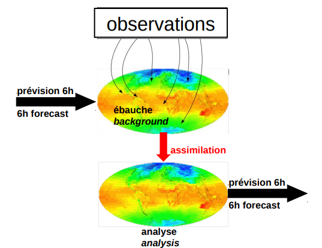

# Filtre Kalman d'Ensemble

Le filtre Kalman d'Ensemble (EnKF) utilise des méthodes de Monte-Carlo pour évaluer la covariance de l'erreur d'analyse, sur un Filtre de Kalman .

## Assimilation de données 

Nous évoluons dans le cadre des méthodes d'assimilation de données pour la Météo.

## Ensemble Kalman Filter (EnKF)

### Statistique de l'erreur

**Représentation de la statistique d'erreur** 

Nous reprenons les notations introduites par .

Pour le filtre de Kalman (**KF**) usuel, et pour un champ $X_t$ les matrices de covariance sont exprimées par rapport à "l'état vrai" du système :
$$
\begin{array}{rcl}
    P^f = \overline{(X_t^f - X_t^t)(X_t^f - X_t^t)^T} \\
    P^a = \overline{(X_t^a - X_t^t)(X_t^a - X_t^t)^T}
\end{array}
$$

La limitation apparâit immédiatement, dans la mesure où "l'état vrai" du système n'est jamais connu. Le Filtre Kalman d'Ensemble (**EnKF**) propose donc de représenter la covariance de l'erreur en référence à une moyenne d'ensemble $\overline{X_t}$. On a alors :

$$
\begin{array}{rcl}
    P^f \approxeq P_c^f =  \overline{(X_t^f - \overline{X_t})(X_t^f - \overline{X_t})^T} \\
    P^a \approxeq P_c^a = \overline{(X_t^a - \overline{X_t})(X_t^a - \overline{X_t})^T}
\end{array}
$$

### Echantillonage par Méthodes de Monte-Carlo

Ici, dans le cadre du Filtre Kalman d'Ensemble, la covariance de l'erreur est représentée en utilisant un ensemble d'états du systèmes,  échantillonné par méthodes de Monte-Carlo. 

Ainsi, en se référant au Théorème Central Limite pour les estimateurs de Monte-Carlo, l'erreur liée à un ensemble de taille $N$ décroît proportionnellement à $\frac{1}{\sqrt{N}}$.

Par extension, en passant à la limite, on peut imaginer un échantillonage de l'espace suffisant, de telle manière que le champ $X_t$
soit décrit par une densité de probabilité limite :

$$\phi(X_t) = \frac{dN}{N}$$

avec $dN$ la densité de points par unité de volume, et $N$ le nombre de points échantillonnés.

_Remarque : La covariance de l'erreur pourrait être représentée en théorie par la densité de probabilité limite formée par une infinité de points._

### Vers une équation différentielle stochastique

En reprenant la dynamique du système associée au filtre de Kalman, le filtre Kalman d'Ensemble propose une résolution
"stochastique" de cette dynamique par méthodes de Monte-Carlo. L'objectif des méthodes de Monte-Carlo étant d'éviter 
les calculs lourds de matrice de covariance d'une part, et d'éviter l'emploi d'une fermeture analytique des équations 
d'évolution de la covariance  de l'erreur _(ou tout simplement d'éviter une modélisation rigide de cette covariance)_.

En associant la dynamique du système d'une part, et son échantillonnage d'autre part, nous pouvons introduire une équation 
différentielle stochastique pour modéliser l'évolution du système :

$$dX_t  = f(X_t) dt + g(X_t) dW_t$$ 

où, comme précédemment, $W_t$ est un mouvement brownien. Cette équation différentielle pouvant intégrée au sens d'**Itô** et résolue par des méthodes numériques telles que la méthode d'**Euler-Maruyama**.

### De Markov Chain Monte-Carlo à l'EnKF

_Bon ... Encore un peu de théorie ! Mais en observant de plus près, on arrive finalement à associer les éléments principaux du cours,
à savoir le filtre de Kalman et les méthodes Markov Chain Monte Carlo._

**Equation de Kolmogorov ou de Fokker-Planck**

L'équation de Fokker-Planck régit les transitions d'un processus de Markov. Il s'agit de l'équation de diffusion pour une densité de probabilité lorsque l'espace et le temps sont continus.

Son expression est la suivante, en 1 dimension :

$$\frac{\partial}{\partial t}P(x,t) = -c \frac{\partial}{\partial x}P(x,t) + D \frac{\partial^2}{\partial x^2} P(x,t)$$

où $c$ est une vitesse de transport et $D$ un coefficient de diffusion.

En dimensions supérieures :

$$
\frac{\partial \phi}{\partial x} + \sum_i \frac{\partial (f_i \phi)}{\partial x_i} = 
\frac{1}{2} \sum_{i, j} \frac{\partial^2 \phi(gQg^T)_{ij}}{\partial x_i \partial x_j}
$$

Lorsque nous utilisons un modèle additif d'erreurs gaussiennes, et que celles-ci forment un processus de Markov, c'est l'équation de Fokker-Planck (aussi appelée équation de Kolmogorov) qui régit l'évolution de la densité de probabilité $\phi(X_t)$ pour l'état du modèle.

Formellement, l'**EnKF** utilise un estimateur **Markov Chain Monte-Carlo** pour résoudre l'équation de **Fokker-Planck**.

_Remarque : nous avions vu l'équation maîtresse, pour les phénomènes continus en temps mais discrets en espace. De manière analogue , l'équation de Fokker-Planck décrit l'évolution d'une densité de probabilité pour **les phénomènes continus en temps et en espace.** Elle s'attache à décrire l'évolution de cette densité selon un transport et une diffusion._

**Analogie avec l'équation de la chaleur**

L'équation de Fokker-Planck nous permet ici de décrire fondamentalement l'évolution de la statistique de l'erreur. En considérant un flux de probabilités _(analogie avec l'équation de la chaleur)_, l'équation décrit un changement de densité de probabilité sur un volume local qui dépend d'un flux de probabilité sur ce volume (issu de la dynamique) et d'un terme de diffusion (qui tend à diffuser ou aplatir la densité de probabilité, dans la mesure où l'erreur statistique croît).

_Remarque : l'équation qui régit formellement les transitions d'un processus de 
Markov sera nommée "équation de Fokker-Planck" par les physiciens, et "équation de 
Kolmogorov" pour les mathématiciens._ 

**Monte-Carlo ou Markov Chain Monte-Carlo ?**

**Monte-Carlo** ou **Markov Chain Monte-Carlo** permettent de construire 2 estimateurs pour résoudre les mêmes équations.

Ici, on pourrait résoudre l'équation de **Fokker-Planck** des 2 manières :
- En utilisant un estimateur de **Monte-Carlo** : il s'agit des, méthodes de filtrage particulaire **(Particle Filter)**.
- En faisant appel à un estimateur **Markov Chain Monte-Carlo** : on obtient alors le
filtre Kalman d'ensemble **(Ensemble Kalman Filter)**.

Cela permet d'introduire 2 méthodes d'assimilation de données : le **filtrage particulaire** et le **filtre kalman d'ensemble**. Nous exposons ici le filtre kalman d'ensemble en pratique.

:::{note} A retenir
On souhaitait utiliser les méthodes stochastiques (MC et MCMC) pour 
simuler et étudier l'évolution de l'erreur sur un système chaotique (par exemple : un modèle Météo). En construisant le raisonnement, nous venons d'établir que nous souhaitons résoudre numériquement l'équation de Kolmogorov, ce qui nous permettrait
d'avoir accès à une densité de probabilité de l'état du système.
:::

_Bon ... Toutes ces maths pour tomber sur un filtre à particule, ça pue un peu comme un vieux diesel ! Passons à une implémentation pratique de ces méthodes._

## Formulation de l'EnKF pour l'analyse 

**Analyse** 

En météo, on parle d'analyse pour les champs de conditions intiales produits par l'étape d'assimilation de données.

Définissons un ensemble d'observations de départ 

$$d_j = d +  \epsilon_i, j \in \{1, ... , N\}$$

Cet ensemble peut être défini ou généré en perturbant des observations., de telle manière que les **erreurs de mesure** ${\epsilon_j}_{1 \leq j \leq N}$ ont une moyenne nulle. La matrice de covariance de l'erreur de mesure est définie comme :

$$R_e = \overline{\epsilon \epsilon^T}$$

_Remarque : On notera que, dans un ensemble de taille infinie, $R$ converge vers la matrice $R$ définie pour le filtre Kalman._

Le filtre Kalman entre alors en jeu avec une étape de prédiction et une étape de correction.

**Prédiction** :  $\hat{X_j} = X^f_j$

**Correction** : $X^a_j = \hat{X_j} + P^f_e H^T(HP_e^fH^T + R_e)^{-1}(d_j + HX^f_j)$

où $X^f$ est un champ issu de la prévision, $H$ est un opérateur d'observation, $R_e$ est la covariance de l'erreur de mesure et $P^f_e$ est la matrice de covariance de prévision du filtre de Kalman. 

En utilisant l'expression du gain du filtre,

$$K_e = P^f_e H^T(H P^f_e H^T + R_e)^{-1}$$

Et la covariance issue de la minimisation de la variance pour l'ajustement du filtre Kalman classique s'exprime comme :

$$P^a_e = (I - K_e H) P^f_e$$

_Remarque : ici, l'EnKF se comporte comme un filtre Kalman dans la limite d'un ensemble de taille infinie._

**Synthèse**

Ici la matrice de covariance liée au bruit d'état (et à la dynamique) s'exprime comme
$$
Q_e = \overline{dW_k dW_k^T}
$$

où $dW_k$ représente le tirage issu du mouvement brownien $dW_t \sim \mathcal{N}(0, dt)$. Ici, $Q_e$ converge également vers $Q$ (matrice de covariance du bruit d'état pour le KF) à la limite d'un ensemble infini.

Les propriétés remarquables sont que l'estimateur de la moyenne évolue selon la dynamique du système :

$$\overline{X_{k+1}} = \overline{f(X_k)} = f(\overline{X_k}) + (non-linear\, terms)$$

La matrice de covariance d'erreur évolue selon :

$$P_e^{k+1} = FP^k_eF^T + Q_e + (non-linear\, terms)$$
où $F$ est l'opérateur tangent linéaire du modèle.

Le Filtre Kalman d'Ensemble se comporte comme un Filtre de Kalman dans le cas d'un ensemble infini. **Dans le cas d'une dynamique non-linéaire**, les résidus non-linéaires sont pris en compte implicitement par l'EnKF, tandis qu'un Filtre de Kalman Etendu (EKF) néglige ces termes.  

**En pratique**, la formulation du filtre de Kalman d'Ensemble ne fait pas intervenir d'opérateur Tangent-Linéaire, ce qui le rend très facile à implémenter.

## Implémentation

